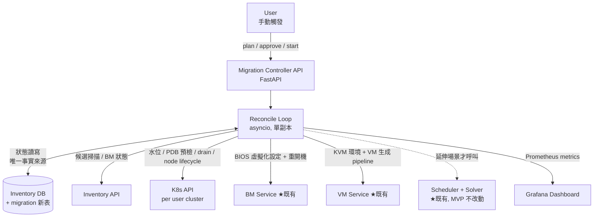
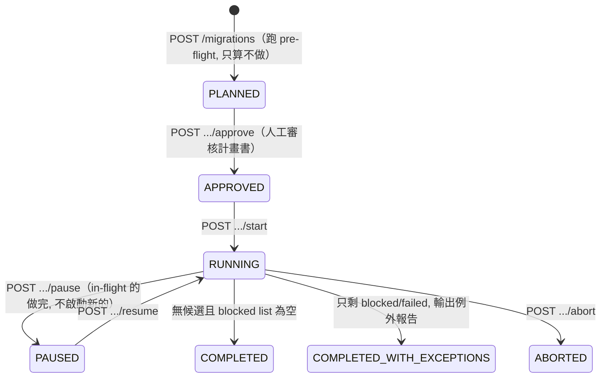
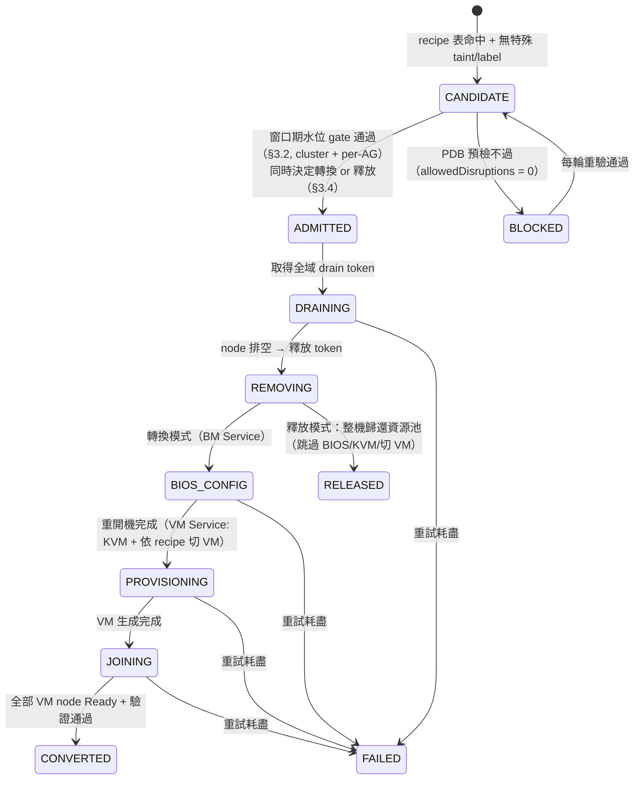

# Enhancement Proposal: BM as Node → VM as Node 遷移編排（Migration Controller）

> **作者**: dysiang（與 Claude 協作整理）
> **日期**: 2026-07-06
> **狀態**: Draft — 待 review
> **相關文件**: `design-review-solver-scheduler.md`（Scheduler + Solver 現況架構）

---

## Summary

我們計畫將「全 Baremetal as K8s Node」的既有 cluster 逐步轉換為「VM as K8s Node」架構，
並在轉換過程與終態都讓 cluster 的 CPU / Memory / Pod usage 水位維持在 **70% 以下**。
這些 cluster 都已有 workload 在跑，因此需要一套可暫停、可審計、可並行的「建新拆舊」編排流程。

本提案新增一個 **Migration Controller**（Python + FastAPI 的獨立服務，operator 式 reconcile loop、
狀態存 Inventory DB），負責整條遷移狀態機；既有的 **BM Service**（BIOS 設定）、
**VM Service**（KVM 環境 + VM 生成 pipeline）作為執行層被呼叫。
**Go Scheduler 與 Solver 在 MVP 完全不需改動**——遷移的容量關卡是確定性算術而非組合最佳化，
solver 保留在延伸場景（spare 跨 cluster 分配、master/infra fault-domain 驗證）備用。

核心設計要點：

| # | 重點 | 一句話 |
|---|------|--------|
| 1 | **確定性切割配方** | 每個可轉換 BM Model 對應固定的 VM 切法（config 表驅動），不需 solver 參與切割 |
| 2 | **雙門檻水位 gate** | 70% 常態目標 + 動態計算的暫時容許上限；聚合式 admission control 管並行 |
| 3 | **Pre-flight 終態檢查** | 轉換有 ~6-10% 永久容量折損，開跑前先算清楚需要幾台 spare，不中途發現 |
| 4 | **Per-AG 並行 + 序列化 drain** | 3 AG 各一台同時轉，但 drain 階段全域序列化，避開 PDB 競爭 |
| 5 | **單一事實來源** | 遷移狀態存 Inventory DB，不引入 CRD/etcd、不引入 Redis |
| 6 | **釋放計算機** | 水位有餘裕時 BM 純退場不轉換、整機歸還資源池；計畫書預估可釋放量，實際決定每輪用即時資料重算 |

---

## Goals / Non-Goals

### Goals

- 定義 BM → VM node 轉換的完整狀態機與每個 gate 的公式
- 全程（窗口期與終態）維持 CPU / Mem / Pod usage ≤ 70%，並遵守 per-cluster max node 上限
- 支援 per-AG 並行轉換（每 AG 單位時間最多一台）
- 只轉換指定 BM Model（config 白名單 + 固定切割配方），其餘維持 baremetal node
- PDB 預檢不過的 BM 跳過並回報，流程繼續；每輪重驗
- 轉換失敗的 BM 標記 `failed` 等人工處理，不自動回滾
- **釋放計算機**：計畫階段預估遷移後可釋放多少資源（整台 BM 退場不轉 VM，供其他用途）；
  轉換 vs 釋放的實際決定每輪以即時水位重算
- 提供 plan → approve → start 三段式 API 與 Prometheus metrics / Grafana 可觀測性

### Non-Goals

- 不改動 Go Scheduler / Solver 的既有 API 與行為（MVP）
- 不處理 local PV / hostPath / emptyDir 有狀態 pod 的資料搬遷（使用者自負）
- 不做 BM 轉換失敗後的自動回滾（BIOS 還原、重灌回 BM node）
- 不做全自動觸發——流程只由人工經 API 觸發（觸發點形式為 open question）
- 不涵蓋 VM image / OS 佈建細節（屬 VM Service 職責）

---

## Current State & Problem

### 現況

- 既有 cluster 為全 BM as node，皆有 workload 運行中，部分 cluster 水位可能已高於 70%
- BM / Cluster / VM 的資料與狀態（含生命週期狀態）都存於 **Inventory DB**
- 已有 **BM Service**（BIOS 虛擬化設定 + 重開機）與 **VM Service**（KVM/libvirt 環境安裝、VM 生成 pipeline）兩個 API 化的執行服務
- Scheduler Service (Go) + Solver (Python) 是 **forward-placement** 系統：輸入 VM spec 或資源預算，輸出擺放計畫

### 既有系統的能力缺口（經 codebase 盤點確認）

| 需求會用到的概念 | 現況 |
|---|---|
| 既有 VM placement（哪台 VM 在哪台 BM） | 不存在；既有負載只以 `used_capacity` 聚合數字表達（`app/models.py:101`） |
| Per-cluster max node 上限 | 不存在；只有 per-requirement `min/max_total_vms` |
| 70% 水位 hard gate | 不存在；只有 `headroom_upper_bound_pct`（預設 90）的 soft penalty（`app/models.py:316`） |
| PDB / drain / node lifecycle / BM 退場排序 | 完全不存在 |
| 長時間流程編排（等待、重試、人工介入） | Scheduler 是 request/response API，無狀態追蹤能力 |

### 痛點

1. **遷移是長時間、多輪、含人工協調的流程**，目前沒有任何元件能承載這種狀態機
2. **容量折損是永久的**：BM 切 VM 後容量少 ~6-10%，若不預先計算，遷移到一半才會發現水位回不去 70%
3. **並行轉換與 PDB 的交互作用**：anti-affinity 把 workload replica 分散到各 AG，
   「每 AG 挑一台同時 drain」恰好是 PDB 的最壞組合，需要顯式的並發控制
4. 手動執行易漏步驟、無審計紀錄、無進度可視性

---

## Proposed Design

### 1. High-level 架構



**元件定位**：

| 元件 | 角色 | 狀態 |
|---|---|---|
| Migration Controller | 大腦：狀態機、gate 計算、並發控制、API、metrics | **新增** |
| Inventory DB | 唯一事實來源：BM/VM/Cluster 狀態 + 遷移流程狀態（新表） | 既有，schema 擴充 |
| BM Service / VM Service | 手腳：冪等的主機操作（透過既有 pipeline） | 既有 |
| K8s API | 水位查詢、PDB 預檢、cordon/drain（eviction API）、node 移除 | 既有 |
| Scheduler + Solver | 備位數學顧問：spare 跨 cluster 分配、master/infra fault-domain 驗證 | 既有，不改動 |

**技術選型**：

- **Python + FastAPI**：與 solver 同技術棧（FastAPI + Pydantic），團隊慣例直接沿用。
  Controller 是純 I/O-bound 編排，總 work item 數十個量級，asyncio 綽綽有餘
- **獨立 service / 獨立 deployment**：不與 solver 同 process——solver 維持 stateless 可水平擴展，
  controller 是單副本有狀態服務，生命週期不同
- **不用 CRD/Operator**：被 reconcile 的對象（外部 BM、外部 user cluster、Inventory）都不是
  management cluster etcd 內的物件，watch 機制用不上；CR 會與 Inventory DB 形成雙事實來源
- **不用 Redis / Celery**：reconcile 模式是 level-triggered——每個 tick 從 DB 讀狀態、
  重新推導下一步，「待辦」由狀態推導而非排入 queue，比 edge-triggered queue 更強壯
  （controller 重啟後下一個 tick 自動續跑）。鎖用程序內 `asyncio.Lock` + DB 欄位持久化即可

```python
# Reconcile loop 骨架（FastAPI lifespan 內的背景 task）
async def reconcile_loop():
    while True:
        for m in await db.get_active_migrations():
            await reconcile_one(m)   # 讀狀態 → 推導下一步 → 打 API → 寫回
        await asyncio.sleep(TICK_SECONDS)
```

### 2. 轉換配方表（Conversion Recipe Table）

只轉換白名單上的 BM Model，切法固定、config 驅動、按原 CPU:Mem 比例切，避免碎小 VM：

```yaml
conversion_recipes:
  - bm_model: "<model-64c-768g>"
    vms: [{cpu: 30, mem_gib: 360}, {cpu: 30, mem_gib: 360}]   # 折損 6.25%
  - bm_model: "<model-64c-1024g>"
    vms: [{cpu: 30, mem_gib: 480}, {cpu: 30, mem_gib: 480}]   # 折損 6.25%
# 不在表上的 model → 維持 baremetal node
```

- **Recipe 驗證器**：載入時檢查 `Σ vm_spec + host_reserve ≤ bm_capacity`，防止超賣配方
- **有效折損率**：原始折損 6.25%（host 保留給 KVM/hypervisor OS），但 kubelet 的
  `system-reserved`/`kube-reserved` 從 per-BM 一份變成 per-VM 各一份，
  **有效折損率保守抓 8~10%**，第一台實測後校正為 config 常數
- **Pod 維度反向變好**：max-pods 沿用 BM 設定（per-node 獨立），1 BM node → 2 VM node
  後 pod 容量翻倍
- Inventory scan 的候選過濾直接由此表驅動；**帶特殊 taint / label 的 BM 排除**（不轉換）；
  新 VM node **繼承原 BM node 的 label**

### 3. 水位公式與 Gate（核心數學）

所有公式 **CPU / Mem / Pod 三維度分別計算，取最差維度**判定。`u` 建議使用尖峰或近期 P95 用量。

#### 3.1 Pre-flight 容量結算：spare 需求與可釋放量（per cluster，開跑前一次性）

轉換造成永久容量折損（有效比例 `r ≈ 0.90~0.92`）。設 `A_keep` 為不可轉換 BM
（不在 recipe 表 / 特殊 taint）維持原容量、`A_conv` 為可轉換 BM 總容量，
全轉終態容量 `C_end = A_keep + r × A_conv`。**spare 需求與可釋放量是同一條式子的兩個方向**：

```
差額 Δ = C_end − U / 0.70

Δ < 0 → 缺容量 → 所需 spare 容量 S ≥ U/0.70 − C_end
Δ > 0 → 多容量 → 可釋放容量 R = C_end − U/release_target
        （release_target 比 70% 保守, 建議 65%, config 可調——釋放難回頭, 要留邊際）
```

**釋放計算機**：`POST /v1/migrations` 的計畫書（只算不做）即扮演此角色，
輸出「需補 N 台 spare」或「可釋放 M 台 BM + 換算資源量」。釋放相關規則：

- **整台為單位**：一台被釋放的可轉換 BM 從 cluster 帳上拿走的是其有效貢獻
  （如 2×30=60 vCore），**歸還資源池的卻是整台實體機（64c/768g）**——
  cluster 不需要這容量時，釋放比留作 VM host 更划算
- **三維度 + per-AG**：釋放同時減少 CPU/Mem/Pod 容量（node 數變少），
  且釋放的 BM 需跨 AG 均勻挑選，避免抽空單一 AG
- **釋放數是預估非承諾**：實際「轉換 vs 釋放」的決定延後到每輪 admission 時
  以即時 U 重算（見 §3.4）
- **釋放冷卻期（soft release）**：釋放的 BM 在資源池中保留 N 週（config，建議 2~4 週）
  標記為「原 cluster 優先召回」，冷卻期滿才開放他用——
  防範「早期釋放 + 後期 U 成長」的跨時間 gap，等於每個 cluster 一張免費後悔票
- **保底 reserve 下限**：釋放額度計算扣除 floor（config，例如「池中至少保留 1 台
  該 cluster 可用的可轉換機型」），不釋放到光

**Spare 方向的推論**：遷移前水位介於 `0.70 × r ≈ 64%` 與 70% 之間的 cluster，
遷移前看似達標、轉完必定超標——必須在計畫階段就排入 spare，而非中途發現。

同時檢查 node 數終態：每台 BM 轉換淨增 +1 node（1→2）、釋放 −1、每台 spare +2，
`終態 node 數 ≤ per-cluster max node 上限`，否則計畫不可行。

數值範例：

- **Spare 方向**：A=1000 vCore（全可轉換）、U=680（68%，看似健康）→ C_end=920 →
  水位 73.9% 超標 → `S ≥ 680/0.7 − 920 = 51.4` → 補 1 台 spare（貢獻 60 vCore）
- **釋放方向**：A=1000、U=500（50%）→ C_end=920、`U/0.65 = 769` →
  `R = 151` vCore 有效容量 → 每台轉換型 BM 有效貢獻 60 → **可釋放 2 台整機**
  （釋放後終態水位 `500/800 = 62.5%`）

#### 3.2 窗口期 admission gate（每次啟動一台轉換前）

同時有多台 BM 不在線時（並行），水位暫時抬升：

```
u' = u / (1 − Σ f_i)     （f_i = 所有 in-flight BM + 本台，各佔 cluster 容量比例）

u' ≤ 70%              → 放行
70% < u' ≤ ceiling    → 放行（暫時容許；窗口有明確結束時間，VM join 後回落）
u' > ceiling          → 先轉一台 spare 加入 cluster 再重算；無 spare 則 skip / pause
```

- **ceiling 建議 80~85%**（open question），理由：超標窗口有時限（BIOS+KVM+join 數小時），
  且下一輪開始前必回落，與常態超標不同
- **並行度是 gate 算出來的結果，不是寫死的 3**：小 cluster 可能只允許 2 並行甚至 1
- **Per-AG 水位也要各算一次** `u'_ag ≤ ceiling`：從 AG 抽走一台 BM 後，
  有 AG 反親和的 workload 只能留在該 AG 其餘機器上，避免局部爆掉
- **Spare 需求不只來自終態，也可能來自窗口期**：例如 pod usage 80% 起跳的 cluster
  （10 node）drain 一台的窗口水位 `80/0.9 = 88.9% > ceiling`，即使 cpu/mem 終態不缺容量，
  第一輪也會被擋、需 spare 先行助跑。好消息是每完成一輪轉換 node 數 +1、pod 容量上升，
  pod 水位快速回落，這類 cluster 只需起步時的 spare

#### 3.3 Spare-first 策略

Spare BM 是空機，轉換**不需 drain / PDB**，直接走 BIOS → KVM → 切 VM → join，
是最便宜的容量來源。順序：pre-flight 算出所需 spare 數 → 先全部轉好加入 cluster →
再開始逐台退 BM，讓每輪的 `u'` 從一開始就有緩衝。

#### 3.4 每輪的轉換 vs 釋放決定（release-last 原則）

計畫書的可釋放量只是 forecast——遷移橫跨數週，U 會漂移、會有 BM 進 blocked/failed。
因此每輪 admission 時對候選 BM 用即時資料重新判定：

```
若這台永久離開後, 終態（三維度+per-AG）仍 ≤ release_target → 走釋放路徑
   （drain → remove → 歸還資源池, 跳過 BIOS/KVM/切 VM, 流程更短）
否則 → 走轉換路徑
```

**排序原則：釋放盡量排在遷移後段。** 提早釋放會永久墊高後續所有輪次的基準水位 `u`，
使後面的 drain 窗口更緊；除非該機器有急迫的外部用途，否則先轉換、後釋放較穩
（open question：釋放優先序政策）。

### 4. 並行模型：Per-AG Lane + 全域鎖

需求：3 個 AG 可各挑一台 BM 同時轉換，但每 AG 單位時間內最多一台。

```
3 條 per-AG lane（各自跑自己的 BM 生命週期）
+ 全域 admission gate（§3.2 聚合水位，控制實際並行度）
+ 全域 drain token（drain 階段序列化）
```

**為何 drain 要序列化（pipeline 並行）**：anti-affinity 正是把同一 workload 的 replica
分散到各 AG——一個 3-replica、`minAvailable=2` 的 deployment 很可能三個 replica
剛好各落在三條 lane 挑中的 BM 上。單台 PDB 預檢每台都過（allowedDisruptions=1 > 0），
但三台同時 drain 會在 eviction API 上互相卡死。因此：

- **drain 是全域序列化的短階段**（單一 drain token）
- **BIOS + 重開機 + KVM 安裝 + VM 生成**（真正耗時數小時的階段）三線並行
- 時序：AG1 drain → AG1 進硬體階段的同時 AG2 才取得 token 開始 drain → 依此類推
- 犧牲的 wall-clock 很少（drain 佔整輪時間的小頭），徹底避開 PDB 競爭
- Phase 2 優化（可選）：候選挑選時做 pod 重疊檢查，無共享 PDB-protected workload 才允許同時 drain

### 5. 狀態機

#### 5.1 Migration（per cluster）生命週期



#### 5.2 單台 BM 轉換生命週期



- **BLOCKED**：記錄 `blocked_reason` + 違規 pod 清單回報 user 協調；**跳過該台繼續下一台**；
  每輪重新預檢，通過即回候選池
- **FAILED**：標記等人工，**不自動回滾**；該台容量在 gate 計算中持續視為「不在線」
- 每步冪等：對 BM/VM Service 的呼叫記錄 job id，requeue 時查狀態推進而非重發
- PDB 之外的 drain 阻礙（local PV / emptyDir 有狀態 pod）**不在本流程處理範圍**

#### 5.3 主流程（每輪迭代）

```
Pre-flight（一次, 含 spare/釋放結算 §3.1）→ Spare 先行轉換 → 逐台迭代：
  掃候選（recipe 表 + taint/label 過濾）
  → admission gate（§3.2）+ 轉換/釋放判定（§3.4, release-last）
  → PDB 預檢 → [drain token] drain → node 退場
  → 轉換：BIOS/重開機 → KVM + 切 VM → join + 驗證
  → 釋放：整機歸還資源池
  → 下一台
終止三態：全部完成 / 繼續 / 只剩 blocked+failed → 例外報告等人工
```

### 6. API 與可觀測性

| Endpoint | 用途 |
|---|---|
| `POST /v1/migrations/preview` | **純試算（釋放計算機）**：同 pre-flight 計算、不落任何狀態記錄。供遷移前討論反覆 what-if（排除某台、調 `release_target` 等） |
| `POST /v1/migrations` | 建立正式計畫：跑 pre-flight，回傳計畫書並落 `PLANNED` 記錄 |
| `POST /v1/migrations/{id}/approve` | 人工審核通過 |
| `POST /v1/migrations/{id}/start` / `pause` / `resume` / `abort` | 執行控制 |
| `GET /v1/migrations/{id}` | 完整狀態（per-BM 進度、blocked list + 原因、水位即時值、已釋放/已轉換數） |

**計畫書輸出欄位**（preview 與正式 plan 共用）：終態水位（三維度）、所需 spare 或
可釋放 BM 數、**釋放機型明細（model breakdown）**、**預估釋放時點（第幾輪之後，
反映 release-last）**、候選/排除清單、預估輪數，以及固定的免責聲明。
對外溝通口徑三共識：

1. **是 forecast 不是承諾**——基於當下 P95 用量；遷移跑數週，實際釋放數每輪重判，
   可能低於預估。給其他團隊的口徑：「預估可釋放 M 台（機型明細），以實際完成為準」
2. **拿到手的時間點在遷移尾段**（release-last），且冷卻期滿才真正開放他用
3. **機型明細與釋放優先序連動**（open question #9），數字必附 model breakdown

計畫書本身即 audit record，延續 scheduler/solver 的可審計文化。

**Metrics（Prometheus → Grafana）**：per cluster/AG 轉換進度、水位即時值（三維度）、
in-flight 數、blocked/failed 數、每輪耗時、drain 時長。

### 7. 資料模型（Inventory DB 新表，草案）

- `migrations`：id、cluster、狀態、pre-flight 快照（終態水位/所需 spare/候選數）、審核者、時間戳
- `bm_conversions`：migration_id、bm_id（引用 inventory 既有記錄）、AG、狀態、
  當前 step、外部 job id（BM/VM Service）、blocked_reason、失敗原因、重試次數、時間戳
- `migration_locks`：drain token 持有者（重啟可恢復）；未來 HA 的 leader lease 亦可放此

BM 本體的狀態欄位（`converting` / `failed` / `converted`）放 inventory 既有表——
其他系統（含 scheduler 容量計算）需要看到「這台正在轉換、容量不可用」。

### 8. Scheduler / Solver 的角色（明確界定）

**MVP：零改動、零呼叫。** 容量 gate 是確定性算術（無組合決策空間），切割由固定配方決定，
硬用 CP-SAT 是反模式。

**延伸場景（備位，均為可選）**：

| 場景 | 用法 |
|---|---|
| Spare 池跨 cluster 分配 | 多 cluster 同時遷移、搶有限 spare 時，變回 placement 問題 → 既有 `/v1/placement/solve` |
| Master/infra role 驗證 | 一台 BM 載 2 個 node 的 fault-domain 集中風險 → 既有 C4/C5 constraint 驗證 |
| Recipe 離線生成 | 機型變多時用 `/v1/placement/split-and-solve` 生成候選配方、人工審核入表 |
| 遷移波次規劃（Phase 3+） | 全 cluster 最優轉換順序/分批 → 延伸既有 `/v1/capacity/plan` 的 multi-period 骨架 |

---

## Alternative & Trade-offs

### 替代方案 A：GitLab Pipeline + Ansible 作為編排器

| 本設計已定的機制 | Pipeline 實作的困難 |
|---|---|
| 聚合式 admission gate（跨 lane 共享 in-flight 集合） | 跨 pipeline 共享狀態需外部 DB + 鎖，等於在 YAML 裡拼半吊子 controller |
| 全域 drain token | 跨 pipeline mutex，CI 無原生機制 |
| Blocked list 每輪重驗 | 退化為 scheduled pipeline 輪詢，狀態與觸發都要另外發明 |
| 數天~數週、多輪迭代 | Pipeline 短命；長等待佔 runner 或靠 timeout hack |
| 從失敗步驟續跑 | Pipeline 重跑是從頭跑 |

**結論**：本流程本質是 reconcile loop + 狀態機，pipeline 硬做會讓所有狀態與鎖外溢。
既有 pipeline **保留為執行載體**（BM/VM Service 背後）與 log 審計，只是不當大腦。

### 替代方案 B：K8s Operator（CRD-based）

- **雙事實來源**：CR 存 etcd、BM 狀態存 Inventory DB，同一遷移的狀態劈在兩個 store，
  違反 single source of truth
- **watch 機制用不上**：被 reconcile 的對象（外部 BM、外部 user cluster）不在
  management cluster 的 etcd 內，只剩定時 requeue——普通服務的 ticker 等價
- **互動模型不合**：三段式審核 API + Grafana 的使用者不是 kubectl/GitOps 使用者

採用 operator 的精髓（level-triggered reconcile、冪等、requeue），不採用其載體。

### 替代方案 C：把遷移邏輯塞進 Scheduler 或 Solver

- Solver 應維持 stateless 數學求解器定位；Scheduler 應維持 placement API 定位
- 水位評估的資料域是 K8s pod usage（pod-on-node），與 solver 的 VM-on-BM 世界模型不同
- 評估公式無組合選擇空間，CP-SAT 是大砲打蚊子

---

## Risk & Mitigations

| 風險 | 影響 | Mitigation |
|---|---|---|
| 並行 drain 觸發 PDB 競爭 | drain 卡死 / 極慢 | 全域 drain token 序列化 drain；Phase 2 加 pod 重疊檢查 |
| 有效折損率估計失準 | 終態水位超標 | Pre-flight 保守用 8~10%；第一台實測校正 config；`u` 用 P95 而非瞬時值 |
| 遷移前水位 64~70% 的 cluster 轉完必超標 | 中途發現回不去 70% | Pre-flight 終態公式強制先算 spare 需求，spare-first |
| BM/VM Service 呼叫非冪等 | requeue 重放造成重複操作 | 與兩服務 owner 確認冪等性 / job id 去重（open question） |
| KVM 安裝失敗等中間態 | BM 懸空（非 node 亦非 VM host） | 標記 `FAILED` 等人工；容量持續視為不在線；不自動回滾 |
| 單副本 controller 掛掉 | 流程暫停（不會錯亂） | Level-triggered 設計：重啟後下一 tick 從 DB 續跑；未來需要 HA 時加 DB lease leader election |
| Inventory 資料與實際漂移 | gate 算錯 | 水位一律即時查 K8s metrics，Inventory 只當 BM 屬性/狀態來源 |
| nodeSelector 綁定 BM 專屬 label | drain 出去的 pod 回不來 | VM node 繼承原 BM label；特殊 taint/label 的 BM 直接排除不轉換 |
| 小 cluster 窗口期水位過高 | gate 永遠不放行 | 動態並行度（可能降為 1）+ spare-first；仍不行則 pre-flight 即回報不可行 |
| 過度釋放後 U 成長、水位回不去 70% | 釋放的 BM 已被挪作他用，難追回 | 五層防線：`release_target` 邊際（65%）+ P95 取樣 + release-last 排序 + 釋放冷卻期（原 cluster 優先召回）+ 保底 reserve 下限 |

---

## Rollout Plan

| Phase | 內容 | 退場路徑 |
|---|---|---|
| **Phase 0** | Controller 只開放 `POST /migrations`（pre-flight 計畫書），**只算不做**；用真實 cluster 資料驗證公式與折損率假設 | 純唯讀，無風險 |
| **Phase 1** | 挑一個低水位、非關鍵 cluster，**串行模式**（並行度=1）跑完整流程；校正有效折損率 | `pause`/`abort`；已轉換的 BM 維持 VM node（不回滾） |
| **Phase 2** | 開啟 per-AG 並行 + drain token；擴大到一般 cluster；上 Grafana dashboard | 並行度可 config 降回 1 |
| **Phase 3**（可選） | Solver 延伸場景：spare 跨 cluster 分配、遷移波次規劃 | 獨立功能，不影響主流程 |

**回滾原則**：`pause` 讓 in-flight 的做完、不啟動新的；`abort` 終止 migration 但已轉換的
BM 不自動還原（回滾 = 人工決策）；`FAILED` 的 BM 一律人工處理。

---

## Open Question

1. **Ceiling 定多少**：80% / 85% / 隨 cluster 規模動態推導（`ceiling ≥ 0.70/(1−f)`）？
2. **觸發點形式**：目前定為人工打 API；未來要不要接 UI / ChatOps / 排程？
3. **有效折損率初值**：8% 還是 10% 起跳？（Phase 1 實測後校正）
4. **BM Service / VM Service 的冪等性保證**：job id 去重是否已支援？需不需要兩邊配合改？
5. **Spare 池的管理權責**：spare BM 由誰供給、算誰的容量帳？多 cluster 搶 spare 時的優先序？
6. **Blocked list 的協調流程**：PDB=0 的 pod 清單回報給 user 後，追蹤與 SLA 由誰 own？
7. **`u` 的取樣窗口**：P95 的回看區間（7 天 / 14 天）？
8. **`release_target` 定多少**：65%？要不要隨 cluster 成長趨勢動態調整？
9. **釋放優先序政策**：優先釋放哪種 BM——不可轉換機型（讓 cluster 更純 VM）、
   大機型（外部再利用價值高）、或依外部需求指定？release-last 原則的例外條件？
10. **冷卻期長度與召回機制**：N 週定多少（2~4 週）？冷卻期內原 cluster 召回的
    觸發條件（水位回升到幾 %）與流程？保底 reserve floor 的具體值？

---

## Decision Log

> 以下為設計討論階段已定案項目；review 後新增決策繼續補充。

| Decision | Reason | Follow-ups |
|---|---|---|
| 水位目標 = usage ≤ 70%（三維度取最差） | 需求原始定義 | — |
| 切割配方固定、config 表驅動（64c/768g→2×30c/360g；64c/1024g→2×30c/480g） | 按原 CPU:Mem 比例切、避免碎小 VM 與記憶體浪費；無組合決策空間 | Recipe 驗證器 |
| MVP 不使用 Solver | 容量 gate 是確定性算術；資料域不合 | 延伸場景備位（§8） |
| Per-AG 並行（每 AG ≤1 台）+ 聚合 admission gate + per-AG 水位檢查 | 並行需求 + 防局部 AG 爆掉 | — |
| Drain 階段全域序列化（pipeline 並行） | 跨 AG 分散的 replica 使同時 drain 成 PDB 最壞組合 | Phase 2 pod 重疊檢查 |
| 失敗中間態 → `FAILED` 等人工，不自動回滾 | 懸空態自動回滾風險高於人工 | — |
| Local PV / emptyDir pod 不處理 | 使用者自負 | 預檢清單仍可列出（資訊性） |
| Label 繼承；特殊 taint/label 的 BM 不轉換 | 避免 nodeSelector 斷鏈 | 排除規則入 config |
| 手動觸發（plan → approve → start 三段式） | 觸發點未定 + 審計文化 | Open question #2 |
| Metrics + Grafana 可觀測性 | 進度可視需求 | Dashboard 規格 |
| VM node max-pods 沿用 BM 設定 | 簡化；Pod 維度容量因 node 數翻倍反而變好 | — |
| 狀態存 Inventory DB（新表），不用 CRD/etcd | 單一事實來源；BM 狀態本就在 Inventory | Schema 草案 §7 |
| Controller 用 Python + FastAPI、獨立 deployment、單副本 | I/O-bound、量級小、與 solver 同技術棧 | HA 時加 DB lease |
| 不引入 Redis / Celery | Level-triggered reconcile 無 queue 需求；避免第二狀態存放處 | — |
| 編排不用 GitLab pipeline 當大腦 | 跨 pipeline 狀態/鎖/長等待均不適配 | Pipeline 保留為 BM/VM Service 執行載體 |
| 釋放計算機併入 pre-flight 計畫書；轉換 vs 釋放每輪以即時水位重判 | 釋放是 spare 公式的鏡像；U 會漂移，計畫值只是 forecast | `release_target` 與釋放優先序（open question #8/#9） |
| 新增 `POST /v1/migrations/preview` 純試算端點 | 討論階段反覆 what-if 不應留下 `PLANNED` 記錄 | — |
| 釋放冷卻期（原 cluster 優先召回）+ 保底 reserve 下限 | 防範「早期釋放 + 後期 U 成長」跨時間 gap | 冷卻期長度與召回條件（open question #10） |
| 計畫書輸出含機型明細、預估釋放時點與 forecast 免責聲明 | 對其他團隊的溝通口徑三共識 | — |
