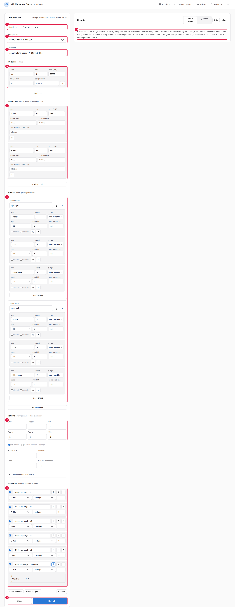
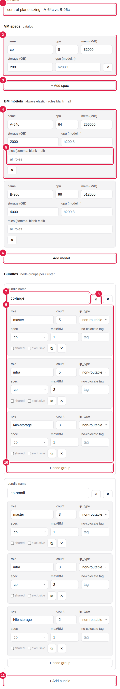
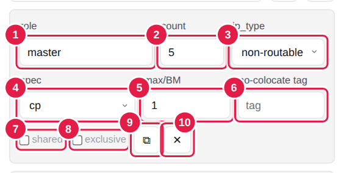
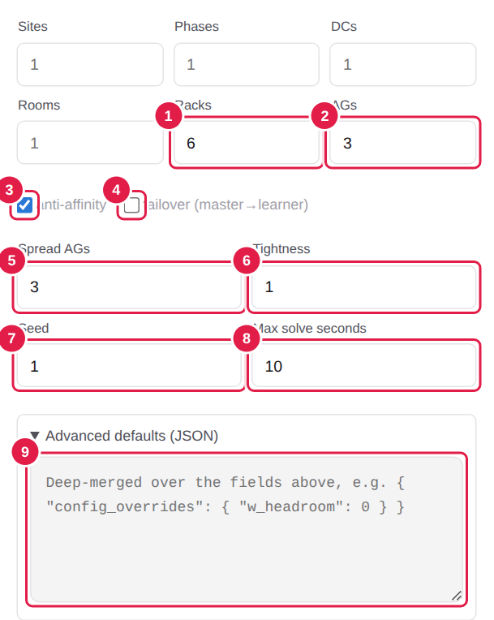
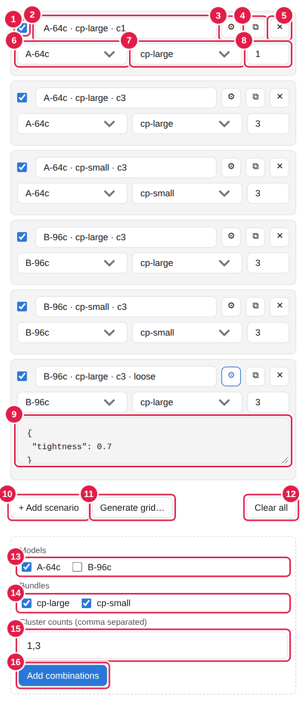
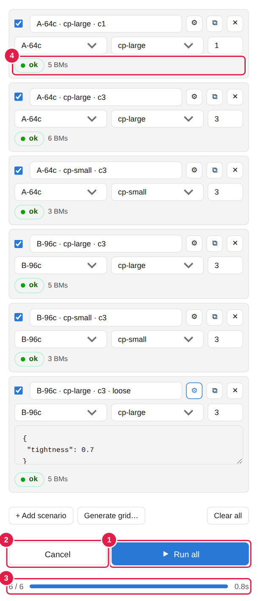
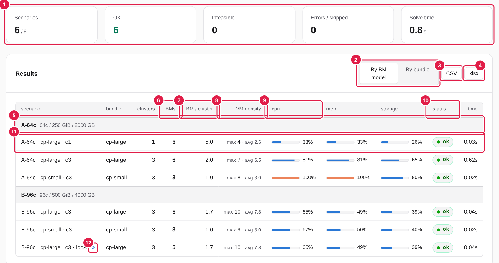
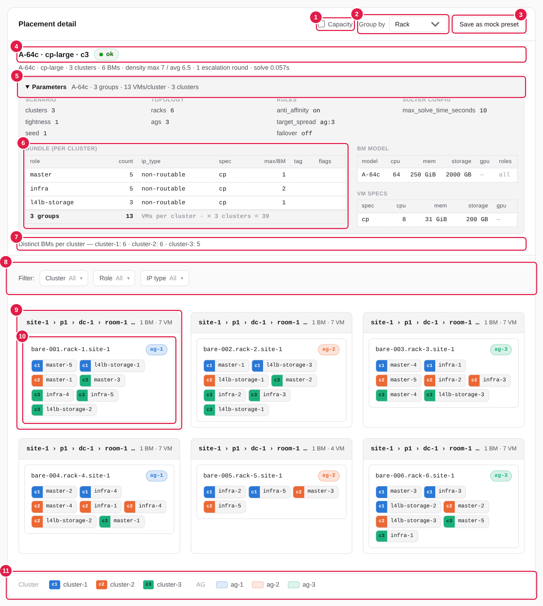
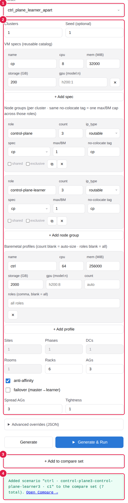

# Compare 頁操作手冊

> 讀者：要比較「哪種 BM 機型、哪種套餐、幾個 cluster 共住」各需要幾台機器的採購 / 規劃人員。
> 不需要懂 solver 內部；需要的名詞第 2 節會解釋。技術規格請看 `docs/compare-sets.md`。

網址：`http://<solver-host>:50051/ui/compare.html`（UI 需伺服器以 `ENABLE_UI=enable` 啟動）。
從任何一頁的頂部導覽列點 **Compare** 也能進入。

---

## 1. 這個頁面做什麼

你定義好「機型目錄」「套餐目錄」與一份「情境清單」，按一次 **Run all**，頁面會逐一替每個情境跑
一次 greenfield sizing（空機起算，用真正的 solver 擺放驗證），然後彙整成一張表：每個情境**要幾台
BM**、每個 cluster 平均幾台、每台 BM 最多塞幾台 VM、資源利用率，點任一列還能看到每台 BM 實際放了
哪些 VM。

整組設定可以存成一個 JSON 檔（**Set**），機型新增或套餐改了，改目錄、重跑即可，不用一格一格重做。

---

## 2. 名詞

| 名詞 | 意思 |
|---|---|
| **Set** | 一份完整的比較設定檔，含三個目錄、Defaults 與 Scenarios 清單。可存檔 / 載入。 |
| **VM spec** | 具名的 VM 規格（cpu / mem / storage / gpu），例如 `cp = 8c / 32 GB / 200 GB`。 |
| **BM model** | 一種機型的容量（cpu / mem / storage / gpu），例如 `A-64c`。永遠由系統決定要配幾台。 |
| **Bundle（套餐）** | **一個 cluster** 需要的 node group 清單，例如 `master×5 + infra×5 + l4lb-storage×3`。 |
| **Node group** | 套餐裡的一列：某個 role 要幾台、什麼 ip_type、用哪個 VM spec、每台 BM 上限等。 |
| **Scenario（情境）** | 一次比較的單位 = **一個機型 × 一個套餐 × cluster 數**，可選擇性覆寫其他參數。 |
| **Defaults** | 所有情境共用的其他參數（rack / AG 數、anti-affinity、tightness…）。 |
| **Overrides** | 單一情境想跟 Defaults 不同的參數，只寫差異的部分。 |

---

## 3. 快速開始（五步）

1. 右上角 **Example set** 選 `control_plane_sizing.json`，表單會整個填好。
2. 看一下左側的 **BM models** 與 **Bundles**，改成你自己的機型與套餐（或先不改）。
3. 按最下方的 **Run all**。
4. 右側表格逐列填入結果；**BMs** 欄就是該情境需要的機器數。
5. 點任一列，下方 **Placement detail** 顯示每台 BM 放了哪些 VM。



| 編號 | 區塊 | 用途 |
|---|---|---|
| 1 | Load set / Save set / New | 載入、下載整份 Set JSON；New 清成空白範本 |
| 2 | Example set | 內建範例（`examples/compare/*.json`） |
| 3 | Set name | 這份 Set 的名稱，也是匯出檔名 |
| 4 | VM specs | VM 規格目錄 |
| 5 | BM models | 機型目錄 |
| 6 | Bundles | 套餐目錄 |
| 7 | Defaults | 共用參數 |
| 8 | Scenarios | 情境清單 |
| 9 | Run all / Cancel | 執行 |
| 10 | Results | 結果表（執行後出現） |

---

## 4. 建立目錄



| 編號 | 操作 |
|---|---|
| 1 | **Set name**：取一個看得懂的名字，例如 `2026Q4 control-plane sizing`。 |
| 2 | **VM spec 卡片**：name 是之後 node group 下拉會用到的名稱；gpu 欄格式 `型號:數量`，例如 `h200:1`，沒有 GPU 留空。 |
| 3 | **+ Add spec**：再加一種規格。 |
| 4 | **BM model 卡片**：name 會成為結果表的分組標題與情境名稱的一部分；容量填整機規格。 |
| 5 | **roles**：留空 = 這種機型什麼 role 都能放；填 `master,learner` = 專屬 pool，只放這些 role。 |
| 6 | **+ Add model**：再加一種機型。 |
| 7 | **bundle name**：套餐名稱（只能用英數、`.`、`-`、`_`）。 |
| 8 | **⧉ 複製套餐**：複製整個套餐（含所有 node group），名稱自動加 `-copy`。常用於「跟這個套餐一樣，只改一個 role 的數量」。 |
| 9 | **Node group 清單**：這個套餐裡的每個 role。 |
| 10 | **+ node group**：在這個套餐裡再加一個 role。 |
| 11 | **+ Add bundle**：再建一個套餐。 |

> 名稱衝突會被擋下來（同名機型、同名套餐）。改了機型或套餐名稱，情境下拉會自動跟著更新。

### 4.1 Node group 欄位



| 編號 | 欄位 | 說明 |
|---|---|---|
| 1 | role | 自由輸入（有常用建議清單），例如 `master`、`infra`、`l4lb-storage`、`control-plane-learner`。 |
| 2 | count | **每個 cluster** 要幾台這種 VM。 |
| 3 | ip_type | `routable` / `non-routable` / none。有 anti-affinity 時，count ≥ 2 的 group 一定要有 ip_type。 |
| 4 | spec | 用哪個 VM spec（來自 VM specs 目錄）；`(default)` = 系統內建的 role 預設規格。 |
| 5 | max/BM | 同一台 BM 最多放幾台這個 group 的 VM。master 通常填 `1`（三台 master 不同機）。留空 = 不限。 |
| 6 | no-colocate tag | **不共站標籤**：填同一個標籤的 group 之間、彼此也不能同一台 BM。例如 master 與 learner 都填 `cp`、max/BM 都填 1，六台就會落在六台不同的 BM。同標籤的 group 的 max/BM 必須相同。 |
| 7 | shared | 勾選 = 這個 group 不是每個 cluster 各一份，而是**所有 cluster 共用一份**（例如 5 個 cluster 共用 6 台 F5）。 |
| 8 | exclusive | 勾選 = **每一台** VM 獨占一整台 BM（appliance 類，如 F5）：其他 group 不能上來，**同一 group 的其他 VM 也不能**。需要專屬 pool 的機型（roles 只填這個 role）。若只是想讓某個 role 專用某種機型但允許同 role 共住，用機型的 roles 欄位加 max/BM，不要勾 exclusive。 |
| 9 | ⧉ | 複製這個 node group（插在下方）。 |
| 10 | ✕ | 刪除這個 node group（套餐至少保留一列）。 |

---

## 5. Defaults（共用參數）



| 編號 | 欄位 | 說明 |
|---|---|---|
| 1 | Racks | 機櫃數。影響 anti-affinity 能分散到幾個桶。 |
| 2 | AGs | Availability group 數。每個 AG 至少會配一台 BM。 |
| 3 | anti-affinity | 同一 cluster 同 role 的 VM 分散到不同 AG（建議開）。 |
| 4 | failover | 產生 master → learner 的 N-1 failover 規則（套餐要同時有 master 與 learner 才有效）。 |
| 5 | Spread AGs | anti-affinity 的目標桶數（軟性目標，不足會給警告）。 |
| 6 | Tightness | 目標利用率。**採購用途請維持 `1.0`**（不預留餘裕，solver 擺出的台數就是要買的台數）。 |
| 7 | Seed | 亂數種子；固定後 rack / AG 配置可重現。 |
| 8 | Max solve seconds | 每個情境給 solver 的時間上限，預設 30。 |
| 9 | Advanced defaults (JSON) | 表單沒有的參數寫在這裡，例如 `{"config_overrides": {"w_headroom": 0}}`。 |

Sites / Phases / DCs / Rooms 留白 = 1。

---

## 6. 建立情境



| 編號 | 操作 |
|---|---|
| 1 | **勾選**：取消勾選的情境 Run all 時跳過，但仍存在清單裡。 |
| 2 | **名稱**：預設自動產生（`機型 · 套餐 · c數`），自己改過就不再自動變。 |
| 3 | **⚙ Overrides**：展開一個 JSON 框，寫這個情境要跟 Defaults 不同的參數。有內容時按鈕會變藍。 |
| 4 | **⧉**：複製這個情境（名稱加 `(copy)`）。 |
| 5 | **✕**：刪除。 |
| 6 | **BM model** 下拉：從機型目錄選。 |
| 7 | **Bundle** 下拉：從套餐目錄選。 |
| 8 | **clusters**：幾個 cluster 共住在同一批機器上。 |
| 9 | Overrides 內容範例：`{"tightness": 0.7}`，只寫差異。可用的 key 與 Defaults 相同；打錯 key 會在執行時被擋下（不會默默忽略）。 |
| 10 | **+ Add scenario**：手動加一列。 |
| 11 | **Generate grid…**：批次新增（見下）。 |
| 12 | **Clear all**：清空情境清單。目錄與右側已有的結果表都保留。 |
| 13–16 | Generate grid 面板：勾機型 (13)、勾套餐 (14)、填 cluster 數清單如 `1,3,5` (15)，按 **Add combinations** (16) 一次加入所有組合；已存在的組合會自動跳過。 |

> 建議流程：先用 Generate grid 產出全部組合，再把不需要的刪掉或取消勾選，比一列一列手動加快。

---

## 7. 執行



| 編號 | 說明 |
|---|---|
| 1 | **Run all**：依序執行所有勾選的情境。執行前會先檢查表單（缺名稱、引用不存在的機型等會在下方紅字提示）。 |
| 2 | **Cancel**：跑到一半可以停，已完成的結果保留。 |
| 3 | 進度列：完成數 / 總數與累計秒數。 |
| 4 | 每個情境列下方會出現狀態：`ok` + 台數、`infeasible`、`error`。 |

每個情境是獨立的一次求解，彼此不影響。一個情境失敗（例如機型太小放不下）只有那一列是 `error`，
其他情境照常。

---

## 8. 讀結果表



| 編號 | 說明 |
|---|---|
| 1 | 統計：跑了幾個、ok / infeasible / error 各幾個、累計 solve 時間。 |
| 2 | **Group by**：依機型分組（「A 機型在各套餐下」）或依套餐分組（「同套餐比機型」）。 |
| 3 | **CSV**：匯出摘要表。 |
| 4 | **xlsx**：匯出兩張工作表：Summary（摘要）與 Placement（每台 VM 落在哪台 BM）。 |
| 5 | 分組標題：機型名稱與容量（或套餐名稱與組成）。 |
| 6 | **BMs**：solver 實際擺上 VM 的機器數。tightness 1.0 時，**這就是採購數**。 |
| 7 | **BM / cluster**：BMs ÷ cluster 數（平均；共住時一台 BM 會被多個 cluster 算到）。 |
| 8 | **VM density**：`max` = 最擠的那台 BM 上有幾台 VM；`avg` = VM 總數 ÷ BMs。max 遠大於 avg 代表擺得不均。 |
| 9 | **cpu / mem / storage**：整體利用率 = Σ VM 需求 ÷ Σ 用到的 BM 容量。超過 90% 顯示橘色。 |
| 10 | **status**：`ok` / `infeasible`（怎麼加機器都放不下，通常是單一 VM 比機型大）/ `error`（設定本身有問題，滑鼠移上去看原因）。 |
| 11 | **點任一列** → 下方顯示 Placement detail。 |
| 12 | ⚙ 標記：這個情境有 Overrides，滑鼠移上去看內容。 |

> 同一個 seed 重跑，台數與利用率會一致，但每台 VM 的確切位置可能不同（solver 在同分數的擺法之間
> 可能換一種）。比較請看數字。

---

## 9. Placement detail



| 編號 | 說明 |
|---|---|
| 1 | **Capacity**：在每台 BM 上顯示 cpu / mem / storage 的使用條。 |
| 2 | **Group by**：rack diagram 依 Site / Phase / DC / Room / Rack / AG 分面板。 |
| 3 | **Save as mock preset**：把這個情境的完整設定下載成 JSON，可在 Topology 頁的 Generate mock 載入重現。 |
| 4 | 情境名稱、狀態，下一行是台數、density、escalation 輪數、solve 時間。 |
| 5 | **Parameters**（可摺疊）：這個情境實際使用的所有參數摘要。 |
| 6 | 套餐表：每個 role 的數量 / ip / spec / max/BM / tag / flags，底部是每 cluster 的 VM 數與 × cluster 的總數。右側是機型與 VM spec 表。被 Overrides 覆寫的參數會標 ⚙。 |
| 7 | 每個 cluster 的 VM 分別落在幾台不同的 BM（精確值）。 |
| 8 | **Filter**：只看某些 cluster / role / ip_type 的 VM。 |
| 9 | 面板 = 一個分組（預設一個 rack 一個面板），標題顯示 BM 數與 VM 數。 |
| 10 | 一台 BM：主機名、AG 標籤，以及放在上面的 VM；每個 VM 標籤左側的色塊是 cluster。 |
| 11 | 圖例：cluster 顏色與 AG 顏色。 |

---

## 10. 儲存、載入與草稿

- **Save set**：把目前整份 Set 下載成 `<set name>.json`。這是正式的保存方式，可以進版控、寄給別人、
  或丟給命令列工具。
- **Load set…**：上傳之前存的 JSON。
- **草稿**：編輯中的內容會自動存在這台瀏覽器裡，重新整理不會不見；但只在這台瀏覽器，換機器要用
  Save set。
- **New**：清掉草稿、回到空白範本。

### 10.1 從 Topology 頁加入情境

在 Topology 頁的 **Generate mock** 表單填好一份設定後，可以直接把它加進 Compare 的草稿：



| 編號 | 說明 |
|---|---|
| 1 | 選一個 mock preset，或自己填表單。 |
| 2 | 表單內容（VM specs、node groups、BM profiles、topology、規則）。 |
| 3 | **+ Add to compare set**：VM specs 併入目錄、每個 BM profile 成為一個機型、node groups 成為一個套餐（名稱自動產生如 `master5-infra5-l4lb-storage3`），其餘參數進 Defaults；第二份起只有與 Defaults 不同的部分進該情境的 Overrides。 |
| 4 | 成功訊息與前往 Compare 的連結。 |

---

## 11. 常見問題

**Q：BMs 是「要買幾台」嗎？**
是，前提是 Defaults 的 tightness 維持 1.0。tightness < 1 代表「我要預留餘裕」，系統會多配機器，但
solver 擺放時仍會集中，BMs 不會跟著變大；此時「含餘裕的採購數」在 CSV / xlsx 的 `bm_fleet` 欄位。

**Q：為什麼 VM density 的 max 比 avg 大很多？**
max/BM 是上限不是配額。例如一台 BM 最多放 master×1 + infra×2 + l4lb×1 = 4 台，solver 為了
anti-affinity 與 AG 分散，有的 BM 放滿、有的只放 1 台。差距大表示擺得不均，可檢視 detail。

**Q：某一列是 `error`，寫 "exceeded 5000 baremetals"？**
那個機型對這個套餐太小（例如 storage 只有 1 GB），系統加到上限仍放不下。檢查機型容量或 VM spec。

**Q：某一列是 `infeasible`？**
通常是單一 VM 在某個維度比機型還大（例如 VM 要 100 核、機型只有 64 核），或 GPU 型號機型沒有。
加再多台也放不下，所以回 infeasible。

**Q：同標籤（no-colocate tag）的 group 為什麼被擋？**
同標籤的 group 必須：都填 max/BM、數值相同、shared 勾選狀態一致；一個 role 只能屬於一個標籤，
且該 role 的所有 group 都要標。錯誤訊息會指出是哪一條。

**Q：改了機型名稱，情境會壞掉嗎？**
不會，情境下拉會即時更新；但如果把情境正在用的機型整個刪掉，下拉會顯示 `(missing)`，Run 時會被擋。

---

## 12. 不用瀏覽器：命令列

同一份 Set JSON 可以直接產表：

```bash
python -m app.compare --input my-set.json --csv output/compare.csv
python -m app.compare --input my-set.json --json output/compare.json     # 含每台 BM 的擺放
python -m app.compare --input my-set.json --only "A-64c · cp-large · c3"  # 只跑一個
```

CSV 欄位與頁面的匯出相同。結束碼：0 全部 ok、1 有 infeasible / error、2 設定檔本身不合法。
API 細節與欄位定義見 `docs/compare-sets.md`。
