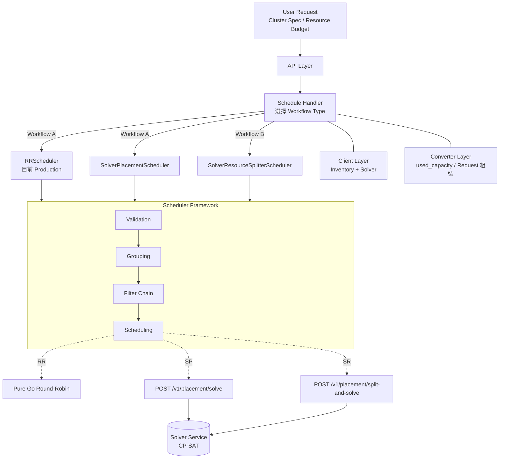
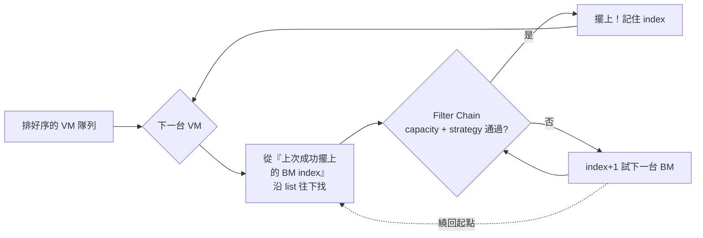

# Design Review: Scheduler Service + Solver 架構

> **作者**: dysiang
> **日期**: 2026-05-21
> **適用版本**: branch `zs/implement-splitter` / Solver 0.1.0
> **受眾**: K8s Infra 團隊（老闆 + 同事）
> **時長**: ~35 分鐘簡報 + 10 分鐘 Open Discussion

---

## Summary

我們把 K8s VM 部署的「**選哪些 BM、怎麼擺**」這件事，從 Excel + Ansible multinode 手作流程，演進成一條可程式化、可審計的調度管線：

```
舊版                                目前 Production                    本場 Review 的下一步
─────────                            ──────────────                     ───────────────
人工挑機 + 手算 AG    ─────────▶    Scheduler Service (Go)     ─────▶  + Solver Sidecar (Python)
Excel 手帳 + multinode               RRScheduler                        SolverPlacement / SolverSplitter
半天/次、易出錯                      秒級、可重現                       全域最佳化、可解釋
```

**四個 takeaway（給聽眾的記憶錨點）**

| # | 重點 | 一句話 |
|---|------|--------|
| 1 | **統一入口** | Scheduler Service 把 ops know-how 變成一支 API，這件事本身就是大躍進 |
| 2 | **Framework 抽象** | 同一條 pipeline 支援 RR、Solver Placement、Solver Splitter 三種策略 |
| 3 | **Joint Optimization** | Solver 一次解「決定幾台 + 擺哪台」，不靠 retry 猜規格 |
| 4 | **可解釋性** | 失敗不再是黑盒，分層 diagnostics 直接指出哪一關卡住 |

**業務面收益（給老闆看的）**

- **BM 用量下降** — Consolidation objective 讓相同負載放進更少 BM，直接省機器
- **減少 P1 風險** — AG 分散、N-1 redundancy 自動驗證，不再靠人工核對
- **加速 cluster build** — 從「半天查表 + 寫 multinode」降到「送一段 spec budget」
- **可審計 / 可回放** — 每次擺放是一份 request+response，可 diff、可 review
- **彈性容量** — Add-node 只要送「我要 +32 CPU」，不必親手算 spec

---

## Goals / Non-Goals

### Goals
- 介紹目前 Production 上的 **RRScheduler**（仍在服役、是 baseline）
- 用 Framework 抽象描述三類 Scheduler（RR / SolverPlacement / SolverResourceSplitter）的共通與差異
- 解釋 Solver 兩個 endpoint 的取捨：`/v1/placement/solve` vs `/v1/placement/split-and-solve`
- 介紹 Solver 的 constraint（capacity / candidate filter / 多維度 anti-affinity / N-1 failover）與 objective（consolidation / headroom / slot-score / resource-waste）
- 說明 Scheduler Service 在業務 / 營運面帶來的好處
- 引導四個面向的 Open Question 討論

### Non-Goals
- 不深入 CP-SAT 內部演算法（只介紹「為何適合此問題」）
- 不細數舊 VM-BM Mapping 的設計缺陷
- 不涵蓋部署 / 容量規劃 / 成本估算（另一場 review）

---

## Current State & Problem

> 篇幅一頁帶過，不是檢討舊系統，而是建立「為何 Scheduler Service 解了問題」的脈絡。

**舊版 VM-BM Mapping 簡述**
- Python Template 描述 cluster 形狀（例：A Type Cluster = 5 BM，BM1 上 HM-8 × 2 + XM-32 × 1）
- 透過 `baremetal_multinode` 描述哪幾台 BM 要用 → 經由 Template 展開成 Ansible multinode
- BM 預設「從空長到滿」；要長部分空間需特別處理；剩餘資源沒 DB，靠人工 Excel 紀錄
- 同一台 BM 跨 cluster 共宿：兩個 cluster 的 `baremetal_multinode` 寫上同一台 BM 的資訊

**痛點（濃縮 3 條）**
1. **人工選機 + 人工算 AG** — 易出錯、難擴展、新人 ramp-up 慢
2. **缺乏增量擺放能力** — 「先放部分、之後再補」、「跨 cluster 共宿」需要人為設計
3. **容量視角缺失** — 超賣風險仰賴人工核對，無自動化視圖

**承接句**：
> 這場 Review 不是要取代 Ansible 或 Template，而是把「選 BM、擺 VM」這層工作自動化、可重現、可驗證。

---

## Proposed Design

### 4.1 整體架構圖

> **白話定義**：Scheduler Service 是「進來一個 Cluster Spec / Resource Budget，出去一份 placement plan」的中介；Solver 是它對外的數學最佳化工具。



**讀圖重點**：
- **Workflow A**（RR + SolverPlacement）：scheduler 已知 VM spec → 只要決定擺哪台 BM
- **Workflow B**（Splitter）：scheduler 只知道 resource budget → 連「幾台、哪種 spec」也要 solver 一起決定
- **Scheduler Framework** 是一條共用的四階段 pipeline，每個 Scheduler 自行決定每階段「跑什麼 / 跳過」
- Client / Converter Layer 是水平支援，提供 Inventory 查詢與 request 組裝

---

### 4.2 Scheduler Service (Golang) 主幹

Scheduler Service 分五層，每層職責單一：

| 層 | 職責 | 重點 |
|----|------|------|
| **API Layer** | 處理 HTTP Route、Request 入口 | 純通訊層，不含業務邏輯 |
| **Schedule Handler** | 根據 request type 選擇 Workflow Type | RRScheduler & SolverPlacementScheduler 屬同一類；SolverResourceSplitterScheduler 屬另一類（因為 splitter 邏輯不同） |
| **Client Layer** | 對外部系統的溝通封裝 | 主要對接 Inventory API（BM 狀態）與 Solver API |
| **Converter Layer** | 將 Inventory raw data 組裝成 Solver 接受的 schema | **責任落點**：`used_capacity` 的計算在這裡完成；解 `vm_specs` / `candidate_baremetals` / `topology` 也在此 |
| **Scheduler** | 實作具體 Scheduler Plugin | 每個 plugin 走 Framework 的四階段 |

> **設計原則**：政策變動頻繁的部分（Strategy Filter、Inventory 對接）留在 Go；數學最佳化（constraint solving）外包給 Python Solver。兩者透過清楚的 JSON contract 解耦，可獨立發版。

---

### 4.2.1 RRScheduler 深入介紹（目前 Production）

> **強調**：RRScheduler 是**目前在跑的**調度器，理解它才能理解 Framework 為什麼這樣切、Solver 補了什麼。

#### 輸入 / 輸出
- **輸入**：每台 VM 的 spec（已固定）+ 候選 BM list + AG 規則
- **輸出**：每台 VM 對應到一台 BM 的 mapping

#### 演算法核心：Greedy with "next-from-last-success"



**白話描述**：「不是每次從頭找，而是接續上次的下一台 BM 開始問」。
這個小設計讓相同 AG group 的 VM 自然均勻散開，走到最後一台會 wrap-around，達到 greedy round-robin 的效果。

#### RRScheduler 的優點（誠實列）
- 簡單、好預測、不需外部服務
- 對小 cluster build 非常快（毫秒級）
- Debug 友善：擺壞了走一遍流程就知道為什麼

#### RRScheduler 的限制（自然帶到 Solver）
- **Greedy → 局部最佳**：早期的擺放決策不可逆，可能讓後面 VM 沒地方去
- **無法跨步驟最佳化**：「先放幾台、晚點再補」這種橫跨多 batch 的 constraint 處理不了
- **無法處理「VM 規格未定」的場景**：split-and-solve 完全做不到
- **沒有 trade-off 機制**：要嘛分散、要嘛集中，無法用 weight 調節
- **失敗訊息薄弱**：只能丟 error，不知道是 capacity 不夠還是 AG 不夠

**這節的意義**：不是「RR 不好所以要 Solver」——RR 已經把人工流程自動化了一大段，是 Production 的功臣。Solver 是在它的基礎上再進一步。

---

### 4.3 Scheduler Framework — 四階段抽象

Framework 把每個 Scheduler 切成四階段，方便 plugin 化擴充：

| Stage | 用途 | RRScheduler | SolverPlacementScheduler | SolverResourceSplitterScheduler |
|-------|------|-------------|--------------------------|----------------------------------|
| **Validation** | input 格式 / 必填欄位檢查 | ✅ | ✅ | ✅ |
| **Grouping** | by AG 將 VM / BM 分群 | ✅ | ❌（交給 solver） | ❌ |
| **Filter** | Capacity / Strategy Filter Chain | ✅ Capacity + Strategy | ✅ Capacity + Strategy | ✅ **只跑 Strategy**（synthetic VM 數未知，Capacity 無從模擬） |
| **Scheduling** | 演算法核心 | Greedy round-robin | call `/v1/placement/solve` | call `/v1/placement/split-and-solve` |

**Filter Chain 的設計**
- 每個 Scheduler 可宣告自己要引入哪些 Filter（Capacity Filter、Strategy Filter、…）
- 依宣告順序逐一執行
- 例：Strategy Filter 可表達「control-plane BM 只給 infra/master/l4lb 角色住」、「一台 BM 限制 N 個某 role 的 VM」

**Q：為什麼 Filter 不全給 Solver？**

A：兩個原因——
1. **Strategy Filter 屬於組織政策**，變動頻繁、語意人讀友善，留在 Go 較易維護
2. **預先剃除明顯不可能的 BM** 可降低 solver 模型規模，加速求解

#### 對照 K8s Scheduler Framework（讓老闆有熟悉感）

| K8s Scheduler Framework | 本案對應 stage |
|-------------------------|----------------|
| PreFilter / Filter | Validation + Filter Chain |
| Score / Reserve | Scheduling（RR greedy 或 Solver objective） |
| Bind | Converter → Inventory commit |

> 概念類似但 scope 不同——K8s 排 Pod 到 Node，我們排 VM 到 BM。

---

### 4.4 Solver Service (Python) 設計

> **白話定義**：Solver 是個 stateless 的 sidecar，接收一份 placement 請求，回傳一份「在所有 hard constraint 下、依 objective 最佳化的」擺放方案 + diagnostics。
> **CP-SAT 白話**：一種可以同時考慮「硬規則」與「偏好分數」的求解器，類似 Sudoku 解題但加上目標分數。

#### 兩個 Endpoint 與取捨

| 維度 | `POST /v1/placement/solve` | `POST /v1/placement/split-and-solve` |
|------|----------------------------|---------------------------------------|
| **Scheduler 提供** | 每台 VM 的確切 spec | 每個 role 的**總資源預算** |
| **VM 數量** | Scheduler 自行決定 | Solver 決定（可加 `min/max_total_vms`） |
| **Spec 選擇** | Scheduler 自行決定 | Solver 從 `vm_specs` pool 挑 waste 最小者 |
| **INFEASIBLE 重試** | Scheduler 猜錯要自行重試 | Solver 在同一次 solve 內找可行解 |
| **Add-node 複雜度** | 自行算「幾台 + 哪種 spec」 | 填總預算 + 正確的 `used_capacity` 即可 |
| **適用場景** | 已知 VM list 的純擺放問題 | Cluster initial build / 彈性 add-node |

**核心觀念：Joint Optimization**

Splitter（決定 spec/count）與 Placement（決定 VM→BM）建構在**同一個 `CpModel`** 上，一次 solve 同時決定兩者。
這避免了「先 split 後 place、結果 anti-affinity 過不去就重來」的 retry 循環。

#### Hard Constraints（C1~C5）

| 代號 | 名稱 | 公式直覺 | 用途 |
|------|------|---------|------|
| **C1** | One-BM-per-VM | `Σ_j assign[i,j] = 1`（partial 模式下 `≤ 1`） | 每台 VM 恰好擺在一台 BM |
| **C2** | Capacity | `Σ demand × assign ≤ available`（per BM × 四維） | CPU / Memory / Storage / GPU 不超量 |
| **C3** | Anti-Affinity | 對 `spread_on` 每個維度，每個桶上限 `cap_per_bucket` 或 `⌈N/\|B\|⌉` | 跨 AG / Room / Rack… 分散，避免同 fault domain 集中 |
| **C4** | Max-per-BM | 同 group 的 VM 在單台 BM 上限 N | 避免單台 BM 故障影響過多 node |
| **C5** | Failover Redundancy | 對任一 fault domain bucket：`P_in + B_in ≤ \|B\|` | N-1 redundancy（master / learner 跨 fault domain 互補） |

**白話 anti-affinity**：「同 cluster 的 master 不要擠在同一機架，這樣一台壞掉時其他還在」。
**白話 failover**：「就算整個 room 掉電，活下來的 learner 數量足夠補上倒下的 master」。

**設計亮點**：
- C3 / C4 可由 solver 依 `(cluster_id, ip_type, node_role)` 自動生成，scheduler 不必為每個 role 手寫規則
- C5 用 `GroupSelector(cluster_id, node_role)` 配對 primary/backup，不必 enumerate VM id
- 新增約束 = 多寫一個 `model.Add(...)`，**不會破壞**現有 constraint

#### Objective Function（多權重最佳化）

```
Minimize:
   -1,000,000 × placed_count          (P0: partial 模式才啟用)
 +         10 × Σ bm_used[j]          (P1: Consolidation — 少用 BM)
 +          8 × Σ headroom_penalty[j] (P2: Headroom — 避免單台 BM 爆 90%)
 -          0 × Σ slot_score[j]       (P3: Slot Score — 保留可用空間，預設關)
 +          5 × splitter_waste        (Splitter 模式：懲罰 over-allocation)
```

**直白翻譯**：
> 「能放下優先；其次少用機器；再來別塞太滿；剩下的空間越能再放標準 VM 越好。」

**Magic：權重量級分離**
- P0 用 1,000,000 量級 → 多放一台 VM 永遠贏過「少用 BM / 避免過載」的所有變化
- P1 vs P2（10 : 8）→ 兩個 trade-off 自動平衡，不必寫 if/else

**Consolidation vs Headroom 自動 trade-off 範例**：
```
BM-A 空閒        → 開啟它 +10（consolidation 成本）
BM-B 已 85% 滿   → 再塞 +16（headroom penalty over=2 × w_headroom=8）
                  → solver 自動選 BM-A
```

#### Diagnostics — 失敗不是黑盒

**白話**：把 constraint 想成「面試關卡」，每關不過就出局，diagnostics 告訴你倒在哪一關。

四條 return path：

| 路徑 | 觸發條件 | 提供什麼 |
|------|---------|---------|
| **INPUT_ERROR** | request 本身違反 schema / 重複 ID 等 | `input_errors: [...]` + advisories；不嘗試 solve |
| **OPTIMAL / FEASIBLE** | 找到（或在 timeout 內找到次優）解 | `assignments` + `advisories`（policy 落差警示） |
| **INFEASIBLE / UNKNOWN** | 確認無解或超時 | `constraint_check.failed_at`（指出哪一層卡住）+ `vms_with_no_eligible_bm` + `infeasible_anti_affinity_rules` + `counts` |
| **Exception** | Solver 內部 bug | `solver_status="ERROR: ..."` |

**分層 constraint check**（INFEASIBLE 時）：
重建 3 個獨立小模型，5 秒 timeout，由淺入深逐層加 constraint，找出**第一個**讓問題變 INFEASIBLE 的層級：

```
Layer 1: one_bm_per_vm     → 失敗 = 某台 VM 沒有任何 eligible BM（最常見）
Layer 2: + capacity        → 失敗 = VMs 個別可放，但總和裝不下
Layer 3: + anti_affinity   → 失敗 = 容量夠，但 AG / fault domain 分散規則衝突
```

**Advisory（成功但要警示）**：
solver 成功擺好，但發現 policy 落差時加註，例如「想 spread 3 個 AG 但只有 2 個 AG」，placement 仍 valid，由 scheduler 決定是否通報 / 拒絕。

---

### 4.5 關鍵設計決策（Cheat-sheet）

| # | 決策 | 為什麼 |
|---|------|--------|
| 1 | **Splitter + Placement 共用同一個 `CpModel`** | 避免 split 完才發現擺不下要重來；joint optimization 結果通常優於 sequential |
| 2 | **Selector-based 規則** | Anti-affinity / Failover 用 `GroupSelector(cluster_id, ip_type, node_role)` 比對；不必 enumerate VM ID，add-node 場景天然穩定 |
| 3 | **Hostname 由 Scheduler 負責** | Solver stateless，不知道 cluster 現有序號；scheduler 收到 `split_decisions` 後依 `max_seq+1` 分配 |
| 4 | **Auto-generated anti-affinity** | 由 solver 依 `(cluster_id, ip_type, node_role)` 自動產生 spread 規則，避免每個 cluster role 手寫 |
| 5 | **Filter Chain 留在 Go** | 政策變動頻繁的部分留在 Go；數學最佳化留在 Python；用 JSON contract 解耦 |
| 6 | **`PlacementResult.diagnostics: dict[str, Any]`** | 故意 untyped，避免 schema 演進綁死 Pydantic；契約透過文件管理（強 / 半 / 弱契約分級） |

---

### 4.6 Scheduler Service 帶來的整體 Benefit

> 這節是**老闆視角**。技術好處只是手段，組織受益才是目的。

#### A. 直接成本面
- **BM 用量下降**：Consolidation objective 讓相同負載放進更少 BM
  - 例：原本 5 台 BM 各 80% 滿 → solver 可能壓到 4 台 90% 滿，省下 1 台
  - 空出來的 BM 可進入低功耗 / 維護模式
- **Headroom-aware 平衡**：避免某幾台被打爆而其他閒置，整體 utilization 更均勻
- _(會議前可補實際 benchmark 數字)_

#### B. 人力 / 效率面
- **Cluster build**：手帳查機 → 挑機 → 寫 multinode 從**半天降到秒級**
- **Add-node**：不用算 spec、不用對 AG，送一句「我要 +32 CPU」即可
- **新人 onboarding**：把調度知識 codified 成 API + constraints，不再依賴老員工口傳

#### C. 風險 / 治理面
- **AG / N-1 redundancy 自動驗證** → 少一次「擺錯 fault domain」P1
- **每次擺放 = 一份 request + response**，可審計、可回放、可 diff
- **INFEASIBLE 結構化原因** → on-call 不再「黑盒重試」

#### D. 戰略面
把 VM 擺放從「Ansible script 副作用」升級成「可程式化的服務」，後面所有自動化才有立足點：
- 線上 rebalance / live migration
- Capacity planning（用 solver 跑 what-if）
- Multi-cluster / Multi-DC 統一調度
- 自動容量推薦

#### E. 對 K8s Infra 團隊的具體影響

> 「Scheduler Service 不只是換工具，它把『VM 怎麼放』這件事從 ops know-how 升級成 platform capability，後面所有自動化都站在這個基礎上。」

---

## Alternative & Trade-offs

### 替代方案：Solver 只做 placement，Scheduler 自跑 splitter loop

**做法**：每次 scheduler 自己猜「幾台 + 哪種 spec」，呼叫 `/v1/placement/solve`，失敗就調整再試。

**為何不選**：
1. **Retry 成本高**：每次 spec 猜錯就要一次 RTT，大型 cluster 可能 retry 多次
2. **Constraint 互相耦合**：anti-affinity 在 VM 數量未定前無法準確驗證；scheduler 無從預判
3. **Joint optimization 結果更好**：Solver 同時看到 split + placement 的搜尋空間，能找出 sequential 看不到的解
4. **責任界線模糊**：splitter 邏輯在 scheduler 端，新增 constraint 兩邊都要改

**結論**：保留兩個 endpoint，讓 caller 依場景選擇；長期 split-and-solve 應為主流路徑。

---

## Risk & Mitigations

| 風險 | 影響 | Mitigation |
|------|------|------------|
| **Solver 求解時間** | 大型 cluster 可能超時 | 30s timeout、`num_workers=8`；回傳 `OPTIMAL` / `FEASIBLE` / `UNKNOWN` 三態；可由 config 調整 |
| **Inventory 資料不一致** | `used_capacity` 算錯導致 over-commit | Converter Layer 為 single source；INPUT_ERROR 偵測 duplicate BM / candidate |
| **Scheduler 端 plugin 爆炸** | 每加一種 strategy 寫一條 ad-hoc flow | Framework 強制四階段切分；新 plugin 只填四個 slot |
| **可解釋性不足** | INFEASIBLE 找不到根因 | Constraint layer check + advisory + diagnostics；後續加 capacity gap 與 per-BM utilization |
| **Solver / Scheduler 版本漂移** | Schema breaking change | `diagnostics` 用「強 / 半 / 弱契約」分級管理；breaking change 走兩階段（v2 並存 → 移除 v1） |
| **Solver 依賴 Python sidecar** | 增加運維元件 | Stateless、可水平 scale；Go scheduler 端有 fallback 至 RR 的路徑 |

---

## Rollout Plan

| Phase | 內容 | 退場路徑 |
|-------|------|---------|
| **Phase 1** | RRScheduler 與 SolverPlacementScheduler 並行，**shadow mode** 比對結果 | Solver 結果僅記錄，不執行 |
| **Phase 2** | SolverResourceSplitterScheduler 上線給**新 cluster build** 使用；現有 cluster add-node 仍走 RR 或 `/solve` | Schedule Handler 一鍵切回 RR |
| **Phase 3** | 全面切到 split-and-solve；舊 endpoint 保留 fallback | 每個 Scheduler Plugin 獨立、可即時切換 |

**Rollback 原則**
- Schedule Handler 是流量切換點
- 每個 Scheduler Plugin 互相獨立，無耦合
- Solver sidecar 掛掉時，Go 端自動 fallback 至 RRScheduler

---

## Open Question — 邀請大家腦力激盪

> 這四節是討論的鉤子，每個面向 2-4 題，挑你有想法的回答即可。

### 1. Scheduler Framework

- 四階段（Validation / Grouping / Filter / Scheduling）的切分是否合理？例如 **Grouping** 該不該屬於 Filter 的一個子階段，而非獨立？
- 未來若有 **Reservation / Preemption** 需求，要插哪一階段？需不需要新增 `PostBind`？
- **Plugin 註冊機制** — 靜態註冊 vs 動態 config，哪種對你們維運更友善？
- Filter 跑兩遍會不會冗餘？（Scheduler 已 Capacity Filter 過、Solver 又驗證一次）

### 2. Solver 介接策略

- `/solve` 與 `/split-and-solve` 兩條路長期應否**合併**（內部以 hint 區分）？還是分開更清楚？
- Request payload 體積大時，是否該走 **gRPC stream**？目前 JSON 是否會成為瓶頸？
- Solver 結果回 Scheduler 後，**hostname 分配責任**放 Scheduler 是否正確？要不要讓 solver 多接一個 hint？
- Solver `solve_time_seconds` 的 SLO 應該訂在哪？（目前 timeout 30s）

### 3. Anti-Affinity / Failover 規則表達

- `spread_on` + `cap_per_bucket` 的 schema 對 operator 是否好理解？要不要再封一層 **DSL** 給 SRE？
- **Auto-generated anti-affinity** 對舊 cluster 是否相容？什麼情境會誤觸發（例如歷史命名不規範的 cluster）？
- **N-1 failover** 目前只支援 master/learner，未來其他 role 對（infra/l4lb）的擴展方式？是否要支援 N-2？
- Anti-affinity 跑不滿（`spread_below_target` advisory）時，是該擋住放置還是只警告？

### 4. 可解釋性 / Diagnostics

- 目前 INFEASIBLE 是「找到第一個失敗的 layer」，要不要改成**列出所有失敗 layer**？
- Advisory 是否該升級為**分級警告**（INFO / WARN / CRITICAL）？對應 scheduler 端的 alerting 行為？
- 是否需要把 solver 的 **search tree / partial solution** 暴露給 scheduler 作為 hint，用來加速增量 re-solve？
- 失敗的根因要不要做出 **UI 視覺化**（topology 上標紅哪台 BM、哪個 AG），方便 on-call？

---

## Decision Log

> 會議後補。模板：

| Decision | Reason | Follow-ups |
|----------|--------|------------|
| _(待填)_ | | |

---

## Appendix（選讀）

- 完整 Request / Response schema → `docs/go-scheduler-guide.md`
- Constraint 詳細數學模型 → `docs/constraints.md`
- Objective Function 公式與 tuning → `docs/objective-function.md`、`docs/objective-function-guide.md`
- 為何選 CP-SAT → `docs/why-cp-sat.md`
- Master/Learner N-1 設計 → `docs/master-learner-redundancy.md`
- Diagnostics 完整流程 → `docs/explainability.md`
- Splitter 設計 → `docs/requirement-splitter.md`、`docs/requirement-splitter-v2.md`