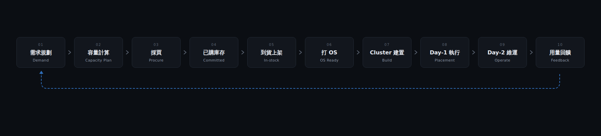

# E2E 敘事 — 從單點 Placement 到端到端 Provision

> **用途**：向團隊/長官介紹 E2E 願景的敘事文件；可直接閱讀，也可作為
> 5–10 分鐘口頭簡報的底稿（講述指引見文末附錄）。
> **配圖**：`images/e2e-nominal-vs-placeable.png`、`images/e2e-lifecycle.png`、
> `images/e2e-two-brains.png`（圖源在 `mockups/`，可重新渲染）。
> **細節文件**：完整設計見 `docs/e2e-vision.md`；本文刻意停在敘事層，不展開細節。

---

## Summary

故事線一句話：**我們從一個「帳面說放得下、機房說放不下」的矛盾出發，把整條
provision 鏈攤開尋找決策引擎的切入點，發現規劃與執行必須共用同一套約束
邏輯——這個發現催生了 capacity planning 功能（Phase 1–3 已完成），下一步
是把這個單點能力串成端到端的閉環。**

---

## 1. 問題：帳面數字會說謊

一個大家都遇過的矛盾：帳面上 fab 還剩 100 vCore，需求單來了 99 vCore，
Excel 說放得下；實際去擺，擺不進去。

原因不是運氣，是**計算方法本身**：帳面是「加總」，機房是「擺放」。剩餘
資源碎在很多台機器上，還要跨 AG 打散、避開同一個 fault domain。

| 指標 | 定義 | 本例 |
|---|---|---|
| **名目可用** | Σ 各機器剩餘資源（帳面加總）| 100 vCore → 判定放得下 ✓ |
| **可落地可用** | 帶碎片與拓撲約束、真實擺得下的量 | 82 vCore → 實際放不下 ✕ |
| **破碎損耗** | 名目 − 可落地（碎片 + 拓撲吃掉的量）| 18 vCore（帳面看不見）|

只要規劃用名目量做決策，這個 gap 就會系統性地變成「規劃承諾、執行跳票」。

---

## 2. 全鏈盤點：solver 能幫上什麼

Solver 原本只站在第 8 站——cluster 建置時的 placement（scheduler 送來
VM 與候選機器，引擎算最佳擺放），這一站已上線運作。我們把整條 provision
鏈從頭攤開，逐站檢視自動化現況：

| 區段 | 階段（對應圖中編號）| 現況 |
|---|---|---|
| **前段** | 01 需求規劃 · 02 容量計算 · 03 採買 | Excel + 人工彙整；**自動化斷層所在** |
| **中段** | 04 已購庫存 · 05 到貨上架 · 06 打 OS | 自動化程度不低：PO 進資產系統、Inventory 自動入庫、OS 狀態機管理 |
| **後段** | 07 建置 · 08 Day-1 · 09 Day-2 | 已由 Scheduler + Solver 接手 |
| **回饋** | 10 用量回饋 → 01 | **斷線**（圖中虛線，尚未接起）|

盤點結論：最大的斷層在最前面——而且關鍵不只是「還是手工」，是**它用另一
顆腦在算**（見下節）。

---

## 3. 核心發現：規劃腦與執行腦必須同一套邏輯

| | 規劃腦（現況）| 執行腦（已有）|
|---|---|---|
| 誰 | Capacity 負責人 | Go Scheduler + Solver |
| 問題 | 要加幾台 node？要買幾台 BM？ | 這批 VM 擺在哪幾台 BM？ |
| 方法 | Excel 名目加總 | CP-SAT：capacity ✕ anti-affinity ✕ topology ✕ failover 聯合求解 |
| 結果 | 會說謊的數字（§1）| 可驗證的擺放 |

兩顆腦邏輯不同，結論就會不同：規劃承諾「買 N 台就夠」，執行時 INFEASIBLE
——而且事後追根因的答案必然是「**規劃當時就不可能知道**」，因為它根本沒有
在算擺放。

**推論**：要讓「規劃時承諾的容量，執行時真的放得進去」，唯一辦法是兩邊用
**同一套約束模型、同一顆引擎、同一份現況快照**。這句話是整個系統的核心
價值主張。

---

## 4. 解法：Capacity Planning（Phase 1–3 已完成）

Capacity planning 不是另起一套規劃工具，而是**把既有 placement 引擎抬上來
給規劃用**：

| 能力 | 說明 |
|---|---|
| 需求 → 計畫 | 輸入 vCore/Mem/Storage/Pod，引擎回答：加幾台 node、買幾台 BM |
| 缺口成因 | 結構化標注：容量不足 / 打散不足 / 機位用罄，指到桶與維度 |
| 誠實頭條 | 報表以**可落地可用量**為準，名目量降為對照欄（直接解掉 §1）|
| 規模 | 多機型採買、多月 roll-forward、多廠區聚合，含報表 UI |

---

## 5. 下一步：把單點串成 E2E

單點能力有了，本次 e2e-vision 討論規劃的是「串起來」——概要三件（細節
一律見 `e2e-vision.md`）：

| # | 功能 | 回答的問題 |
|---|---|---|
| 1 | **需求單一條龍**（demand_id）| 一張需求單從開單、納入計畫、採買、到貨，一路追到建置完成；滿足方式（現貨/新購）由引擎每期重算 |
| 2 | **Plan vs Actual 校準迴路** | 每月用 Inventory 真實快照對帳，量測「承諾兌現率」：上期說放得下的，這期真的放進去了多少 |
| 3 | **一致性守門** | 用測試保證「規劃說可行 ⇒ 執行真的可行」不隨時間沉默劣化 |

對照生命週期圖：那條虛線（用量回饋 → 需求規劃）就是目前斷著、要接起來的
最後一哩。接起來，這條鏈才是閉環，而不是斷頭的直線。

---

## 6. 結語

我們在做的不是「一個會排機器的工具」，而是**一個可以被驗證的承諾——
規劃時說放得下，執行時就放得下**。上述每個功能，都是在讓這個承諾可以
被交付、被量測、被守護。

---

## 附錄：口頭講述指引（5–10 分鐘）

| 幕 | 對應章節 | 時間 | 放圖 / 動作 |
|---|---|---|---|
| 1 · 矛盾開場 | §1 | ~1 分 | 名目 vs 可落地 |
| 2 · 攤開全鏈 | §2 | ~2 分 | 生命週期圖，逐區段講 |
| 3 · 兩顆腦 | §3 | ~2 分 | 規劃腦 × 執行腦 |
| 4 · Capacity Planning | §4 | ~1.5 分 | （可展示 UI mock）|
| 5 · 串成 E2E | §5 | ~1.5 分 | 回生命週期圖，**指虛線** |
| 收尾 | §6 | ~0.5 分 | — |

- 只有 5 分鐘時：§2 的逐段介紹縮成一句「前段人工、中段已自動化、後段已有
  solver」。
- §5 刻意不深入；被追問細節時導向 `e2e-vision.md` 或另約設計 review。
- 三張圖與 UI mock（`mockups/e2e-ui-mock.html`）風格一致，簡報可混用。
