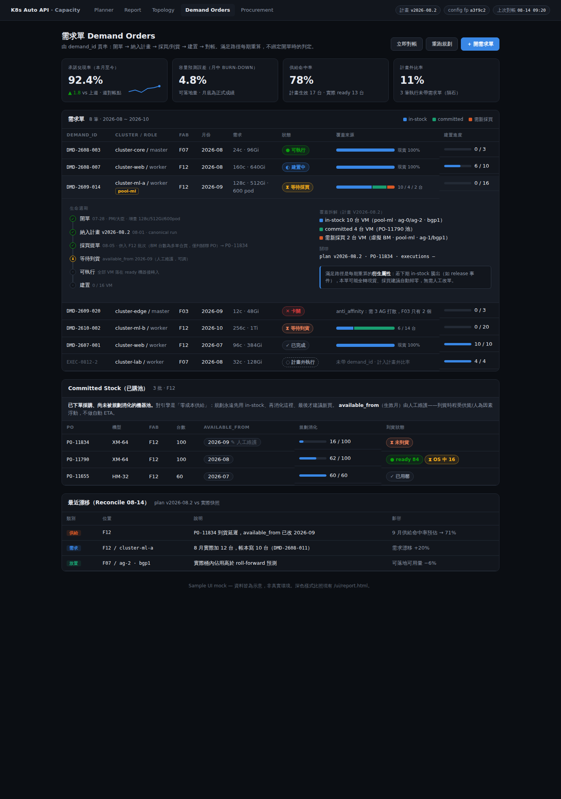
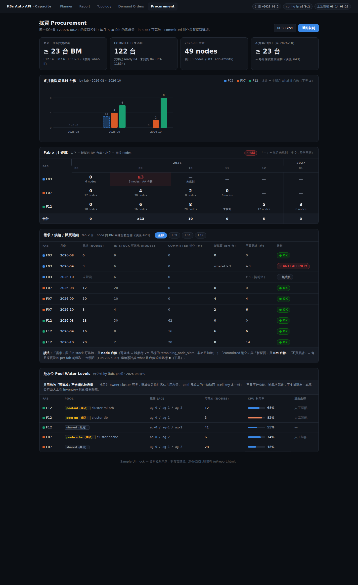

# E2E Vision — 從農場到餐桌：Provision 端到端自動化願景

> **作者**: Claude (claude-code) × dysiang（設計討論共筆）
> **日期**: 2026-07-27
> **狀態**: Design 草稿 — 待 review，不含實作
> **前置文件**: `docs/capacity-planning.md`（Phase 1–3 已實作、43 條決議）、
> `docs/design-review-scheduler-solver.md`、`docs/go-scheduler-guide.md`
> **本文 Decision Log 從 #1 起新編**，與 capacity-planning.md 的 #1–#43 互不衝突
> （關係見文末〈與既有決議的關係〉）。

---

## Summary

Capacity planning 的引擎能力（Phase 1–3：Pod 維度、採買 bin-pack、多月
roll-forward × 多 fab 報表）已完成，但它目前是一個**單點**：輸入靠手工組、
輸出靠人搬運、與真實世界的採買/到貨/建置之間沒有資料迴路。本文規劃「它之後
的事」：把需求規劃 → 容量計算 → 採買 → 到貨上架 → cluster 建置 → 回饋的整條
鏈串成 E2E。

核心價值主張不變且被強化：**規劃期與執行期共用同一套約束模型，保證「規劃時
承諾的容量，執行時真的放得進去」**。本文交付五塊設計：

1. **E2E 階段地圖**（S1–S10）與缺口收斂 —— 缺的不是十個功能，是三條橫向管道。
2. **demand_id 一條龍** —— 需求單從開單貫串到建置完成的識別線。
3. **Plan vs Actual 校準迴路** —— canonical run + reconcile + 四個命中率指標。
4. **規劃/執行一致性保證** —— filter profile、config 指紋、一致性回放測試。
5. **獨佔 BM 池** —— 規劃期必須知道的 per-cluster 資格過濾（比照 BGP 模式）。

邊界原則貫穿全文：**solver 維持無狀態純函式決策引擎**；狀態、持久化、流程
ownership 在 Go Scheduler Service 與上游（Capacity 負責人、H/W team）。
本文所有 solver 端改動皆為 additive，所有新狀態皆落在 Go 端。

---

## Goals / Non-Goals

### Goals
- 盤點 E2E 鏈的每一站：solver 接觸點、資料契約、現況（已有/部分/缺）。
- 設計 demand_id 貫串線：開單 → 納入計畫 → 採買/到貨 → 建置 → 對帳。
- 設計校準迴路：計畫快照、reconcile 純函式、對 Capacity 負責人有意義的命中率指標。
- 設計一致性保證：讓「規劃說可行 ⇒ 執行可行」成為被測試守護的性質，而非願望。
- 產出 Go 端契約清單（G1–G7）與 solver 端改動清單（S1–S6），含優先序。
- 產出分階段、各自可獨立交付、可回滾的 roadmap（E0–E5），與既有 backlog 合併排序。

### Non-Goals
- **不實作** —— 本文只交付設計（比照 capacity-planning.md 的做法）；每個 solver
  端改動落地前各自走 plan-first + ADR。
- **不做 Day-2 深水區** —— migration（`bm-vm-migration.md` 提案）與 rebalance
  列 backlog；本次範圍是 **Cluster Build-up + 既有 cluster add-node + 規劃回饋迴路**。
- 不做採買議價 / 成本最佳化 / TCO（沿用 capacity-planning.md Non-Goals）。
- 不翻案既有 43 條決議 —— 本文只延伸（`(bucket, network)` 計量單位加 pool 維度、
  committed stock 加生效月），無任何一條被推翻。
- **solver 不越界成流程 owner** —— 需求輸入品質、採買決策、流程 ownership 屬
  Capacity 負責人與上游；solver 只提供決策與量測。

---

## E2E 階段地圖

### 全鏈拆解（S1–S10）

| # | 階段 | 現況做法 | Solver 接觸點 | 資料契約 | 狀態 |
|---|---|---|---|---|---|
| S1 | 需求規劃 | PM×User 談需求，Capacity 負責人談細節，活在 Excel | 需求進 `demand_book` | `DemandEntry`（已定）；正式帳本應住 Go（既有決議 #25/#41），**Go 端目前無此功能** | **缺**（greenfield；CSV 匯入 #42 為過渡橋）|
| S2 | 容量計算 | 負責人向各廠 owner 蒐集 in-stock，Excel 手產採買量 | `/v1/capacity/plan`（Phase 1–3 ✅）| `CapacityPlanRequest` 的系統側輸入目前手工組裝 | **部分**：引擎已有，快照聚合缺 |
| S3 | 採買提需求 | 負責人向 H/W team 提需求 | `budget_view` 即提需求依據 | solver→人方向已有；「已提未購」追蹤屬上游 | **已有**（solver 側）|
| S4 | 已購庫存 | H/W team 執行採買 | `committed_stock`（3h ✅）| PO 表（採購單號↔BM 資產對應）**有 API**；無 ETA（到貨時程本質浮動）| **部分**：缺 PO→committed 推導 + 生效月 |
| S5 | 到貨上架 | 資產系統登錄 → **Inventory CronJob 自動撈入 DB** → BM Service | 無直接接觸；供給面 plan-vs-actual 的落點 | 到貨自動化**已存在**；缺「committed 畢業成 in-stock」的帳務規則 | **部分** |
| S6 | 打 OS | 各廠 owner 走另一內部系統 | 無；BM 生命週期狀態影響候選池 | **狀態機已存在**；OS 未 ready 由 Go filter 排除（執行期）| **已有**（執行期）；規劃期納入規則見一致性設計 |
| S7 | Cluster 建置 | UI 點選 → template → VM 規格/數量 | `/v1/placement/solve`、`/split-and-solve` ✅ | 既有 placement 契約 | **已有** |
| S8 | Day1 執行 | Go scheduler 真實放置 | 無；計畫 vs 實際的落差在此誕生 | 缺 demand_id 透傳與執行落帳 | **缺** |
| S9 | Day2 維運 | add-node、換修、除役 | add-node ✅；fleet events `release` 設計已定（既有決議 #40）| `ExistingDistribution` / `ExistingBmOccupancy` 已定義 | **部分** |
| S10 | 用量回饋 | 無系統化迴路 | reconcile（本文新設計）| 缺 plan-vs-actual 契約 | **缺** |

### 缺口收斂：三條結締組織

十站盤點完，缺口不是散在十處，而是收斂成三條橫向管道 —— 全部落在 solver
邊界外（Go 端或上游），solver 只需契約對齊：

- **A. 需求帳本管道（S1→S2）**：Excel/口頭 → 結構化 `DemandEntry` 帳本 +
  upsert API + demand_id 發號。沒有它，E2E 的起點永遠是手工。
- **B. 現況快照管道（S2、S7 共用）**：Inventory → 一鍵聚合出 `in_stock` +
  `existing_distributions` + `existing_bm_occupancy` + `procurement_caps` +
  `committed_stock`。**規劃與執行共用同一快照來源**是一致性保證的地基。
- **C. 事件與回饋管道（S3→S10）**：採購確認（→committed_stock）、到貨
  （→committed 畢業）、除役（→fleet `release`）、實際放置（→執行落帳）、
  月結對帳（→校準）。這條管道是校準迴路的載體。

### 名詞對齊（採買落點語言）

採買落點語言統一為 **AG（虛擬 DC；實體上至少散 3 櫃，rack 級由 DC Hardware
Team 張羅）**。與既有決議 #29（`max_bm` 掛桶）、#10（`procurement_spread_dimension`
可切 `ag`/`datacenter`）一致。PO 表只有目的地 fab、沒有桶 —— 沒關係，
`committed_stock.bucket=None`（浮動、solver 決定落點）本來就支援。

---

## 設計主題 1 — demand_id 一條龍（需求單貫串線）

### 需求帳本的 INPUT / OUTPUT 契約

帳本每列 = `(cluster_id, node_role, period)` 為唯一鍵，值是該月增量需求
（對映既有 `DemandEntry`）。

**INPUT（寫入端：Capacity 負責人 / PM）**
- `upsert(entries[])` — 同鍵覆蓋（last-write-wins，既有決議 #25），稀疏可送。
- `bulk_import(CSV 長表)` — 既有決議 #42 格式，重複鍵報錯。
- `delete(key)` — 區分「刪列＝未規劃」與「留列全 0＝確定不長」（月份三態 #26）。
- **發號**：建立時產生穩定 `demand_id`（過渡期 CSV 匯入用鍵值決定性生成，
  如 `fab-clusterA-worker-2026-09`）。

**OUTPUT（讀取端：規劃流程）**
- `get_book(from=當月)` — 當下及未來月份的完整快照，直接餵
  `CapacityPlanRequest.demand_book`。唯一必要的讀。
- （進階，校準迴路才需要）`get_book_as_of(plan_id)` — 「產出某期計畫時帳本長
  怎樣」。第一步以「每次 canonical run 把 request 整包存檔」代替（見 G4）。

### 貫串機制

```
開單（帳本發號 demand_id）
  → 納入計畫（canonical run 的報表帶 per-demand 覆蓋標註）
  → 採買/到貨（committed 池，available_from 人工維護）
  → 建置（UI 選需求單；Go 把 demand_id 作 pass-through metadata 帶上
     placement request/response 並落帳）
  → 對帳（reconcile 靠 demand_id join 需求漂移與兌現率）
```

- **Solver 不理解 demand_id** —— 純透傳 + 回吐，不碰求解邏輯，無狀態不破。
- **未帶 demand_id 的執行 = 計畫外需求**，本身是指標（計畫外比率）：隕石多常
  砸、多大顆，是說服上游「請走帳本」的數據，而非系統外的黑數。

**Alternatives**：
- (a) 事後用 `(cluster, month)` 匹配推斷 —— 同月多筆、跨月執行時歧義，對帳吵架。
- (b) 不做關聯、只比容量面 —— 失去承諾兌現率這個核心價值主張的量測。
- 故選 demand_id 貫串。代價：UI 建置流程多一步「選需求單」。

### 滿足路徑是衍生屬性，不是開單時的決定

需求單只表達**意圖**（要多少資源），不綁定滿足方式。in-stock / committed /
新採買是 **solver 每次 canonical run 的輸出**：引擎本來就是「先用 in-stock →
再消化 committed（零成本）→ 才建議新買」的分層目標（既有決議 #39）。因此：

- 「原判定要新採買、後來 in-stock 騰出」→ 下期全域重解自然轉現貨，**無需改單**。
- 反向（提單後才發現不用買）→ 機器終究會到，進 committed 池被優先消化，不浪費。
- 計畫黏住的只有**已執行的真實 placement**；規劃中的分配每期都是新鮮的。

**覆蓋標註**（solver 端改動 S2）：引擎求解時每台規劃 VM 都知道自己落在真實
in-stock BM、committed 虛擬 BM、或新採買虛擬 BM 上，現況只是聚合後丟掉了。
新輸出：

```json
{ "demand_id": "DMD-2609-014",
  "coverage": { "in_stock": 10, "committed": 4, "new_buy": 2 } }
```

需求單狀態機由 Go/UI 從三份資料 join 衍生（solver 無狀態）：

```
demand_id 狀態 = f(最新 plan 覆蓋標註, 執行紀錄, committed 到貨狀態)
  已規劃 → 等待採買/到貨 → 可執行 → 建置中 → 已完成 / 卡關(ShortfallDetail)
```

**誠實限制**：BM 採買台數無法精確歸屬單一 demand_id（多張單合買、joint solve
合著算）；**node 級覆蓋精確、BM 級只有概量**。追蹤 UI 用前者即足。

### 兩個 view 分開：需求單 view ≠ 採買 view

- **需求單 view**：「我的需求進行到哪」—— per-demand 狀態與進度。
- **採買 view**：「每 fab 每月要買/已買幾台」—— 既有 `budget_view`（決議 #22）
  + committed 池狀態面板。
- 兩者是**同一份 plan 的兩個投影**，同源不打架，但頁面分開、不混為一談。

### committed_stock 生命週期（與 in_stock 的邊界）

**in_stock = 已站在機房裡的機器；committed_stock = 錢已花、機器在路上。**

| | in_stock | committed_stock |
|---|---|---|
| 實體狀態 | 已到貨上架、Inventory 有資料 | 已下採購單、未到貨/未上架 |
| BM id / 拓撲 | 有（AG/rack/BGP 已知）| 無（機型+台數+fab；落點浮動由 solver 定）|
| 引擎成本 | 免費、最優先 | 免費（已付）、第二順位（`w_committed_stock`）|
| 時間性 | 現在就是容量 | `available_from` 生效月起才是容量 |

```
plan 建議採買 → 提單 → committed_stock（已購未到）
             → 到貨上架、資產登錄 → Inventory CronJob 撈入
             → 畢業成 in_stock（同時從 committed 池扣除）
```

兩條配套規則：

1. **`CommittedStock.available_from`（solver 端 S1）**：人工維護生效月，預設空
   = 當月可用（向後相容）。**不做自動 ETA** —— 到貨時程受供貨/人為因素浮動，
   假 ETA 比沒有更糟。Alternatives：(a) 維持現狀當期可用 —— 系統性高估前期容量；
   (b) 全域固定 lead-time —— 假精準。故選人工欄位，漂移由 reconcile 量測。
2. **畢業推導（Go 端）**：`committed 剩餘台數 = PO 台數 − 該 PO 已出現在
   Inventory 的台數`。PO↔BM 資產對應表已有 API，可全自動、免人工對帳，
   天然避免同一台機器算兩次。

---

## 設計主題 2 — Plan vs Actual 校準迴路

### 迴路骨架

```
每月一次 canonical plan run（vN）
   輸入 = 當下真實快照（B 管道）+ 當前需求帳本（A 管道）
   輸出 = CapacityReport；request+response 整包存檔（Go 端，G4）
        ↓ 真實世界運轉：placement、到貨、隕石、換修…
reconcile（純函式，隨時可跑）
   輸入 = 上期 plan vN 的預測 + 此刻真實快照 + 執行紀錄
   輸出 = 漂移報告（每格誤差 + 成因歸類 + 四指標）
        ↓
下期 plan v(N+1) 天然以真實快照為起點（自動校正、誤差不累積）
```

關鍵觀察：既有決議 #27（重算永遠從當下往未來、過去 baked 進 in-stock）意味
**校準機制天生存在** —— 每次重算就是一次校正。缺的只有兩塊：plan 快照持久化
（否則沒有「上期怎麼說」可對）、對帳計算與指標定義。

### 節奏：帳本粒度與量測節奏解耦

- **帳本與採買規劃維持月粒度**（採買語言就是月，既有決議 #2 不動）。
- **reconcile 隨時可跑**：月中跑=本月進度視角（兌現率/供給命中率天然可累計；
  容量預測誤差月中是 burn-down，**月底那次才是正式成績**）。
- **週命中率**：週 cron 跑 reconcile 即得，帳本完全不用動。
- **手動觸發優先**（隕石驅動：需求大改、大批到貨時人工重跑）；cron 後補。

**Alternative**（週帳本）：把帳本切到週粒度 —— 否決：採買規劃 by 月，週帳本
對 Capacity 負責人是純負擔，且量測需求用「隨時可跑的 reconcile」就滿足。

### 漂移四分類（對帳報告骨架）

| 成因 | 定義 | 誰行動 |
|---|---|---|
| 需求漂移 | 帳本寫 X、實際建置/追加 Y（靠 demand_id join）| 負責人 ↔ PM（含「隕石沒走帳本」的制度問題）|
| 供給漂移 | 計畫生效台數 vs 實際到貨/ready 台數與月份 | 負責人 ↔ H/W team（調 `available_from`）|
| 放置漂移 | roll-forward 假設落點 vs 真實 placement 落點 | 我們（引擎假設 vs 執行差異，餵一致性設計）|
| 機隊漂移 | 換修、除役、借調等未入模型的機器變動 | fleet events（`release`/`add`）|

### 命中率指標（收斂成四個頭條）

發散過的候選：逐 BM 佔用誤差（太細，違反既有 #21 粒度決議）、名目資源誤差
（被碎片假象污染，違反 #5 精神）、solve 次數/INFEASIBLE 率（工程指標，
負責人無感）。收斂後四個，粒度全部停在 `(fab, AG×BGP, month)`：

| 指標 | 定義 | 回答 |
|---|---|---|
| **承諾兌現率**（頭條）| 該月執行的 build/add-node 中「計畫已預留容量、且執行 placement 成功」的 VM 數 ÷ 計畫承諾 VM 數 | 核心價值主張的直接量測 |
| **容量預測誤差** | 每格「上期預測期末可用量」vs「實際期末可用量」偏差（以**可落地量**為準，名目量輔助欄）| 我的模型準不準 |
| **供給命中率** | 計畫採買/committed 生效台數 vs 實際 ready 台數（分月）| 上游到貨拖累多少 |
| **計畫外比率** | 未帶 demand_id 的執行佔比 | 隕石多常砸、制度漏了多少 |

四者對應四個行動對象（模型/我們、需求方、供給方、制度面），漂移報告能直接
說「這期沒中是因為誰」。

### `/v1/capacity/reconcile`（solver 端 S3）

```
POST /v1/capacity/reconcile          # 純函式：進什麼算什麼，不存任何東西
Request:
  plan:                              # Go 端存檔的上期 canonical run
    plan_id, created_at, config_fingerprint
    predicted_cells[]                #  CapacityReport 的 (fab,AG,BGP,月) 預測值
    demand_snapshot[]                #  當時帳本（含 demand_id）
    procurement_decisions[]          #  當時建議：買 K 台 / committed 生效 + available_from
  actual:
    as_of: "2026-08-14"              # 對帳時間點（月中可跑）
    in_stock[] / existing_* / committed_stock[]   # 與 CapacityPlanRequest 同源同格式
    executions[]                     # Go 落帳：{demand_id?, cluster, role, vm_count,
                                     #   status, period, infeasible_cause?}
  config: SolverConfig               # 同一份 shared config
Response: ReconcileReport
  headline: {fulfillment_rate, forecast_error, supply_hit_rate, unplanned_ratio}
  cells[]:  每格 predicted vs actual 可落地可用量 + 名目對照欄 + delta
  drifts[]: DriftDetail{category: demand|supply|placement|fleet,
                        cell, delta, demand_ids?, message}   # 結構化+人話，比照 ShortfallDetail
```

**計算步驟與放 solver 的理由**：

1. 攤開 plan 每格預測期末狀態（`CapacityReport` 現成）。
2. 對真實快照**重算每格可落地可用量** —— 與規劃同一套 bin-pack-until-INFEASIBLE
   （`reference_vm_spec`）。**這步 Go 做不了**：Go 只能加總名目量，名目誤差被
   碎片假象污染（既有決議 #5 的同一理由）。這是 reconcile 進 solver 的唯一硬
   理由，其餘皆 diff。
3. 逐格 diff + 漂移歸類（供給/需求/放置/機隊）。
4. 聚合四頭條。

**Alternatives**：(a) Go 端 diff —— 只能比名目量，退回假指標；(b) UI 端算 ——
違反 canonical JSON 優先（#24）。存放依然在 Go，solver 維持無狀態。

**誠實聲明**：v1 歸類是規則式的；邊界案例（一格同時供給遲到+臨時需求）歸多類
並標注，不假裝完美歸因 —— 比照 `ShortfallDetail` 可多筆的做法。

---

## 設計主題 3 — 規劃/執行一致性保證

### 發散：兩邊算出不同答案的六個來源

| # | 來源 | 例子 | 性質 |
|---|---|---|---|
| D1 | Candidate 推導差異 | 規劃把「到貨未 OS」算容量、執行 filter 掉；獨佔池只有 Go filter 知道 | **最危險**：規劃說放得下、執行放不下 |
| D2 | Config 漂移 | plan 用權重 v1 算、執行時 config 已改 v2 | 可預防 |
| D3 | 現況時差 | plan 基於 T0，執行在 T1，中間容量被別人吃掉 | 不可消除，只能量測+校準 |
| D4 | 引擎版本漂移 | solver 升版後 packing 形狀不同（都可行但落點不同）| 影響預測誤差，不影響可行性 |
| D5 | 粒度差異 | 規劃停在桶級+虛擬 BM；執行挑真實 BM | 設計內建（#21），須聲明而非消除 |
| D6 | 模式差異 | 規劃 allow_partial、執行 strict | 已知語意差，文件化 |

### M1 — Filter Profile 制度化（解 D1，最重要）

Go filter stage 已可按功能組不同 chain；制度化 = 三件事：

1. **具名**：兩套組合各有名字（`planning` / `execution`），非散裝臨時組。
2. **顯式差集**：差異維護成明文清單（文件+版本），不用讀 Go 原始碼才知道。
3. **強制決策**：任何新 filter 必須宣告進哪個 profile —— 防「新 filter 只掛
   execution，planning 從此永遠高估卻無人發現」的沉默漂移。

差集清單（**已定案**）：

| BM 狀態 | execution | planning | 理由 |
|---|---|---|---|
| OS 未 ready | 排除 | **納入** | 確定會 ready，是規劃期容量 |
| 維修中 | 排除 | **納入** | 維修週期 1–2 週，短於月粒度 |
| 保留機 | 排除 | **排除** | 保留=送人、不會 release，非我方容量 |

**Alternative**：filter 全搬進 solver —— 否決：政策變動頻繁屬 Go（既有分工
決議），且讓 solver 越界。

### M2 — Config 指紋（解 D2/D4）

config 維持 request 自帶（無狀態不破）。引擎對「生效 config + 引擎版本」算
決定性 **`config_fingerprint`**，在**每個** response（plan 與 placement）回吐
（solver 端 S4）。Go 落帳；reconcile 比對：指紋不同 → 漂移報告標「本期誤差
含 config/引擎變更因素」。**Alternative**：中央 config 服務 —— 過重，引入
solver 對外依賴。

### M3 — 一致性回放測試（守門 D1–D6）

保證「**plan 說可行 ⇒ execution solve 可行**」被測試守護：

```
拿同一時刻真實快照 S、同一筆需求 D：
  ① S(planning profile) → /v1/capacity/plan     → 可行、無缺口
  ② S(execution profile) → /split-and-solve      → 必須也可行
① 可行、② INFEASIBLE 且原因不在顯式差集內 → 紅燈 = 保證破了
  （抓 filter 漂移 / config 漂移 / 引擎版本差異）
```

兩層落地：solver repo 內合成快照單元級（我方自主，S5）；跨 repo 真實快照
E2E 級（Go 掛鉤 G7：同時刻快照匯出（raw + 兩個 profile）+ 定期雙跑 job；
② 是純函式呼叫，dry-run 天然成立）。

### D3（時差）：不預防、只校準

月節奏 + 手動重跑 + 命中率量測。**預留機制**（plan 承諾的需求在 Go 端鎖容量、
執行時保證不被吃掉）能把兌現率推向 100%，但代價大：預留是狀態（Go 端帳）、
降低整體利用率、與「每期全域重解」哲學有張力 → **v1 不做，列 Open Question**，
等命中率數據證明時差漂移真的痛再議。

---

## 設計主題 4 — 獨佔 BM 池（dedicated pools）

**情境**（已確認為真實需求）：特定 cluster/user 獨佔一批 BM。每 fab 現有
2 個獨佔池、長期存在、**池跨多 AG（池內要打散）**。

### 執行期：既有機制已支援

獨佔 = 兩條 candidate 過濾規則的合成，均為 Go filter stage 既有能力：

1. Cluster A 只能用池 P → A 的 `candidate_baremetals` = P（同 BGP/role 過濾）。
2. 池 P 只有 A 能用 → 其他 cluster 的 candidate 剔除 P（同「control-plane BM
   只給 infra/master/l4lb」的政策 filter 先例）。

### 規劃期：必補，否則系統性說謊

規劃層若不知道獨佔池，池容量會被算進「大家都能用」的可落地可用量 —— 別的
cluster 規劃說放得下、執行被 filter 擋掉。這是 D1 最惡性的形態：**系統性高估**
而非隨機漂移，直接違反核心價值主張。所以不是「要不要納入」，是**池存在就必須
納入**。

### 設計：比照 BGP network 過濾（既有決議 #36/#37 的同構延伸）

獨佔池與 BGP 數學上同構 —— **per-cluster 資格 filter，不是 spread 維度**：

```python
Baremetal.pool: str = ""          # ""=共用池；系統側資料（Inventory/Go 政策表），非 user 填
DemandEntry.pool: str = ""        # 由 cluster 註冊資訊帶入（provenance #14 不變）
# 規則：pool=X 的需求只看 pool=X 的 BM；pool="" 的需求只看 pool="" 的 BM
# 採買：獨佔池殘量 → 虛擬 BM / committed 掛 pool 標籤（比照 network 做法）
```

- **計量單位**延伸為 `(AG/DC, BGP[, pool])` —— 僅有獨佔池的 fab 才展開 pool
  維度，報表不全面爆炸。
- **池內打散**：池跨 AG 時，anti-affinity 的 `reachable_buckets` 由候選 BM 算
  （既有機制），自然只在池所及的 AG 間展開 —— 零新機制。
- **池滿政策（實作後修訂，見 Decision #22）**：只有一條路——**採買進池**
  （虛擬 BM 掛 pool 標籤）。spill（溢出吃共用池）曾實作為 `PoolPolicy` +
  assignment-level 罰項，經 Capacity 負責人 review 後**整段移除**：隔離改為
  結構保證；真需要溢出時人工調配（Inventory 改機器 pool 標籤，下次
  canonical run 生效）。設計與實作保留於 ADR-003 追記與 git 歷史。

### Pool 是報表切面，不是平行功能

「有池之後很多功能要不要 by 池看？」—— 要，但**不是每個功能各做一套 by-池
邏輯**。pool 進了三個源頭之後，所有下游視圖**自動繼承**這個維度：

| 源頭（一次實作）| 下游繼承（零額外設計）|
|---|---|
| cell key 加 pool 維度（`(fab, AG/DC, BGP[, pool])`）| 水位/容量報表 by 池展開、容量預測誤差 by 池、reconcile drifts 指到池 |
| `DemandEntry.pool`（系統帶入）| 需求單 view 的 pool 標籤、承諾兌現率/計畫外比率 group by pool |
| PO / committed / 採買虛擬 BM 掛 pool 標籤 | 採買 view 按池分列、供給命中率 by 池 |

兩條紀律：

1. **共用池的可落地可用量不含獨佔池容量**（誠實頭條的延伸：池只對 owner
   可見，混算=系統性高估共用容量）。
2. **無池的 fab 報表形狀完全不變**（pool 維度只在有池處展開）。

反面原則：**不為池另開平行功能頁**。「檢視各池水位」是水位報表的一個
group-by，不是新功能；「池的命中率」是四指標的一個切面，不是第五個指標。

**Alternatives**：
- (a) 池模擬成 pseudo-fab（利用 per-fab 自給自足迴圈隔離）—— 否決：池與本 fab
  其他機器共享 AG 拓撲與實體機位（`max_bm` 是物理的、跨池共用），假 fab 會把
  機位帳算錯，報表出現不存在的 fab。
- (b) 規劃期忽略、靠 reconcile 事後抓 —— 否決：系統性偏差不是隨機漂移，
  事後量測不能替代事前正確。

納入 **E2**（快照聚合階段）一起做 —— E2 正是補平「Go filter 知道、規劃不知道」
差距的階段；引擎側為 S6（models pool 欄位 + capacity_planner candidate 推導 +
採買標籤），落地前走 plan-first + ADR。

---

## 契約清單

### Go 端（G1–G7）

| # | 契約 | 內容 | 依賴 | 優先序 |
|---|---|---|---|---|
| G1 | **需求帳本 API** | (cluster, role, month) 帳本：upsert / 刪列 / CSV 匯入 / `get_book(from=當月)` / **demand_id 發號**；(進階) `get_book_as_of` | — | **P0** |
| G2 | **快照聚合 API** | 一鍵組出 `CapacityPlanRequest` 系統側輸入：in_stock（planning profile）、existing_*、procurement_caps、**committed 推導**（PO − 已入 Inventory）、`available_from` 存放、**pool 標籤** | Inventory、PO 表 API（已有）| **P0** |
| G3 | **Filter Profile 制度化** | `planning`/`execution` 具名 + 顯式差集（已定案）+ 新 filter 強制宣告歸屬 | G2 | **P1** |
| G4 | **Plan 快照持久化** | canonical run 的 request+response 整包存檔（plan_id、created_at、config_fingerprint）| — | **P1** |
| G5 | **demand_id 透傳與執行落帳** | UI 建置選需求單；placement 帶 pass-through metadata；executions 落帳（含計畫外執行）| G1 | **P1** |
| G6 | **Reconcile 編排** | 組裝「上期 plan + 當下快照 + executions」呼叫 reconcile；儲存/呈現漂移報告；手動優先、週 cron 後加 | G4、G5、S3 | **P2** |
| G7 | **一致性測試掛鉤** | 同時刻快照匯出（raw + 兩 profile）+ 定期雙跑比對 job | G3 | **P2** |

### Solver 端（S1–S6，全部 additive，各自 plan-first + ADR）

| # | 改動 | 內容 |
|---|---|---|
| S1 | `CommittedStock.available_from` | 人工維護生效月；空=當月（向後相容）|
| S2 | 覆蓋標註輸出 | per-demand coverage counts + demand_id 回吐 |
| S3 | `/v1/capacity/reconcile` | 純函式對帳（見設計主題 2）|
| S4 | `config_fingerprint` | 所有 response 回吐（plan 與 placement）|
| S5 | 一致性測試（solver 側）| 合成快照雙跑單元測試 |
| S6 | 獨佔池 | models pool 欄位 + capacity_planner candidate 推導 + 採買 pool 標籤 + 池滿雙開關 |

---

## Risk & Mitigations

| 風險 | 類型 | 緩解 |
|---|---|---|
| Go 端投入不足，三條管道停在紙上 | 組織 | roadmap 每階段獨立可交付；E0（純 solver 端）不依賴 Go 即可先行；CSV 匯入讓 E1 前仍可運作 |
| 「選需求單」流程改動遭遇推行阻力 | 組織 | 計畫外比率把「不帶單」變成可見指標而非禁令；帶單率目標值漸進拉高 |
| reconcile 歸因規則式、邊界案例歸類含糊 | 技術 | 多類歸屬 + 標注（比照 ShortfallDetail 可多筆）；不假裝完美歸因；先求方向正確 |
| `available_from` 人工維護過期失真 | 營運 | 供給命中率直接量測它的準度；漂移報告點名到 PO |
| filter profile 差集清單腐化（新 filter 沒宣告）| 技術/流程 | M3 一致性測試紅燈守門；code review checklist |
| 獨佔池讓報表維度膨脹 | 技術 | pool 維度僅在有池的 fab 展開；共用池報表形狀不變 |
| plan 存檔膨脹（整包 request+response）| 技術 | JSON 壓縮 + 保留期政策（Go 端決定）；月一次 canonical，量可控 |

---

## Roadmap（E0–E5，與既有 Backlog 合併）

各階段獨立可交付、可回滾（全 additive）：

| 階段 | 內容 | 價值假設 | 驗收方式 |
|---|---|---|---|
| **E0** | S1 + S2 + S4（solver 端小改）| 輸入更誠實（committed 生效月）、輸出可追蹤 | 單元測試 + `/verify-solver` |
| **E1** | G1 需求帳本 + UI Load/Save（既有決議 #41 演進項）| 需求數位化 = E2E 有起點 | Capacity 負責人一輪月度規劃全走帳本，Excel 只剩匯入來源 |
| **E2** | G2 快照聚合 + G3 filter profile + **S6 獨佔池** | canonical run 一鍵化、規劃輸入零手工、規劃不再高估池容量 | plan 輸入全自動組裝；差集文件化有指紋；池容量帳正確 |
| **E2.5** | fleet events `release`（既有決議 #40，設計已定）| 機隊漂移可入模，E4 指標更準 | 除役月容量正確釋放、報表標注 |
| **E3** | G4 plan 存檔 + G5 demand_id 一條龍 | 兌現率**可量測**的前提；需求單追蹤 UI 上線 | 新 build/add-node 帶單率 > 目標值 |
| **E4** | S3 reconcile + G6 編排 | 命中率讓計畫品質可見、可歸因；週量測 | 第一份月結漂移報告產出且被負責人實際使用 |
| **E5** | S5 + G7 一致性守門 | 「承諾放得下」不沉默劣化 | CI 綠燈 + 定期真快照回放 |
| 隊尾 | no-buy what-if（節點級，E4 後）；跨 fab 調撥（既有 Phase 4）；Day-2 migration/rebalance | | |

排序原則：**功能面先於命中率**（E1–E3 先把鏈串起來，E4–E5 再量測與守門）；
E1 先於 E2（帳本是 demand_id 之根）；fleet events 提前到 E2.5（早於回饋迴路，
讓機隊漂移在指標上線時已可入模）。

---

## Open Questions

1. **預留機制**：v1 不做。等 E4 命中率數據證明「時差漂移」真的痛，再評估
   Go 端容量鎖定的成本（狀態、利用率下降、與全域重解的張力）。
2. ~~池滿政策細部~~ → **已定案（Decision #22）**：spill 移除、嚴格隔離、
   採買一律進池；溢出需求人工調配。
3. **`get_book_as_of` 版本化**：先用 plan 整包存檔頂替；何時值得上真正的帳本
   版本查詢（例如需要審計「誰在何時改了需求」時）。
4. **帶單率目標值與治理**：計畫外比率的可接受水位、超標時的制度動作
   （屬 Capacity 負責人 ownership，solver 只供數字）。
5. **需求單追蹤 UI 的歸屬**：正式版住大 UI（K8s Auto API 平台）還是先在
  solver 的無狀態 UI 沙盒 demo（比照決議 #41 的三角色）。

---

## 附錄 — UI Mock（設計輔助，非實作）

為了讓設計討論「有感覺」，本文附一份互動式 UI mock：
**`docs/mockups/e2e-ui-mock.html`**（單檔、無依賴，瀏覽器直接開啟；
頂部 Demand Orders / Procurement 分頁可切換，資料皆為示意）。
深色樣式比照現有 `/ui/report.html`。

### 需求單 view（demand_id 一條龍）

展示設計主題 1：需求單狀態鏈、覆蓋來源三色條（in-stock / committed / 新採買）、
展開的生命週期時間軸、計畫外執行、committed 池（`available_from` 人工維護）、
reconcile 漂移列表與四個頭條指標（含週對帳點 sparkline）。



### 採買 view（同一份 plan 的採買投影）

展示設計主題 1 的「兩個 view 分開」與決議 #43：fab ×（年,月）矩陣
（大字=新採買 BM 台數、小字=需求 nodes、卡關月 what-if `≥` 下界、未規劃月
「—」三態）、逐月採買長條圖、需求/供給/採買明細（node 與 BM 台數分欄）、
池水位面板（決議 #21 的 by-池切面）。



---

## Decision Log

| # | Decision | Reason | Follow-ups |
|---|---|---|---|
| 1 | E2E 本次範圍 = **Cluster Build-up + add-node + 規劃回饋迴路**；Day-2（migration/rebalance）列 backlog | 先把主鏈串通；Day-2 有獨立提案（bm-vm-migration.md）| 隊尾排序見 Roadmap |
| 2 | 缺口收斂成**三條結締組織**（帳本 A / 快照 B / 事件回饋 C），全在 solver 邊界外 | 缺的不是十個功能是三條管道；solver 只需契約對齊 | G1–G7 |
| 3 | **帳本月粒度不變，量測節奏解耦**：reconcile 純函式隨時可跑，週命中率=週對帳點；手動觸發優先 | 採買語言是月（#2 不動）；週帳本是純負擔；隕石需要手動重跑 | cron 後補 |
| 4 | **`CommittedStock.available_from` 人工維護生效月**，預設空=當月；不做自動 ETA | 到貨時程本質浮動（供貨/人為），假 ETA 更糟；現狀「當期可用」高估前期容量 | S1；供給命中率量測其準度 |
| 5 | **committed 畢業自動推導**：剩餘 = PO 台數 − 已入 Inventory 台數 | PO↔資產表已有 API；免人工對帳、免 double count | G2 子項 |
| 6 | **demand_id 一條龍**：帳本發號 → plan 覆蓋標註 → 執行透傳落帳；未帶單=計畫外執行（入指標）| 無識別線則兌現率只能事後猜；(cluster,month) 匹配有歧義 | G1/G5/S2；UI 多一步「選需求單」|
| 7 | **滿足路徑=每期重算的衍生屬性**，需求單只表意圖不綁定 in-stock/committed/新採買 | 引擎分層目標（#39）天然支援換手，免人工改單 | BM 台數不歸屬單（node 級精確、BM 級概量）|
| 8 | **需求單 view 與採買 view 分開**（同一 plan 兩投影）| 職責不同：進度追蹤 vs 編預算；BM 合買無法按單歸屬 | 採買 view=既有 budget_view + committed 面板 |
| 9 | **命中率四指標**：承諾兌現率（頭條）/ 容量預測誤差 / 供給命中率 / 計畫外比率；粒度 (fab, AG×BGP, month) | 各對應一個行動對象；逐 BM 太細（#21）、名目誤差被碎片污染（#5）、工程指標無感 | E4 上線 |
| 10 | **漂移四分類**：需求 / 供給 / 放置 / 機隊；可多類歸屬+標注 | 歸因指到行動者才有用；不假裝完美歸因 | 比照 ShortfallDetail 結構 |
| 11 | **reconcile 進 solver**（`/v1/capacity/reconcile` 純函式），存放在 Go | 可落地量重算需引擎 bin-pack；Go 只能比名目（假指標）；UI 算違反 #24 | S3/G6 |
| 12 | **plan 快照持久化在 Go**：request+response 整包 + plan_id + config_fingerprint | solver 無狀態；沒有存檔就沒有「上期怎麼說」 | G4；保留期政策 Go 定 |
| 13 | **Filter Profile 制度化**：planning/execution 具名 + 顯式差集 + 新 filter 強制宣告 | 防沉默漂移（新 filter 只掛一邊）；差集是政策決定須明文 | G3；M3 測試守門 |
| 14 | **差集定案**：planning 多含「OS 未 ready + 維修中（1–2 週）」；保留機兩邊排除（送人不回）| OS/維修終會 ready、短於月粒度；保留機非我方容量 | — |
| 15 | **config_fingerprint**：config 維持 request 自帶，引擎回吐指紋（config+引擎版本）| 無狀態不破；中央 config 服務過重 | S4 |
| 16 | **一致性回放測試兩層**：solver repo 合成快照 + 跨 repo 真快照雙跑 | 「plan 可行 ⇒ execution 可行」須被測試守護而非願望 | S5/G7 |
| 17 | **預留機制 v1 不做** → Open Question | 預留=狀態+利用率代價+與全域重解張力；先讓命中率數據說話 | E4 後評估 |
| 18 | **獨佔池規劃期必須納入**：pool 標籤比照 BGP filter 模式（#36/#37 同構延伸）；計量單位 (AG/DC, BGP[, pool])；池內打散靠既有 reachable_buckets；池滿=雙開關（by-池採買 / spill 設定）| 不納入=系統性高估共用容量（D1 最惡性形態）；pseudo-fab 會算錯共用機位帳 | S6 併入 E2；spill 細部列 OQ |
| 19 | **Roadmap E0–E5**：功能面先於命中率；E1 帳本先於 E2 快照；fleet events 提前至 E2.5 | 帳本是 demand_id 之根；機隊漂移早入模讓 E4 指標更準 | 各階段獨立交付可回滾 |
| 20 | **名詞對齊**：採買落點語言=AG（虛擬 DC，實體至少散 3 櫃）；PO 表無桶沒關係（committed 浮動）| 對齊 #29/#10；rack 級屬 DC HW Team | — |
| 21 | **Pool 是報表切面不是平行功能**：pool 進三個源頭（cell key / DemandEntry / PO·採買標籤），所有視圖與四指標自動繼承 by-池切面；共用可落地不含池容量；無池 fab 形狀不變；不為池另開功能頁 | 一次實作全域繼承，避免 by-池邏輯散落各功能各自為政 | S6 實作時落地三源頭 |
| 22 | **Spill 能力移除，池嚴格隔離**（修訂 #18 的池滿雙開關為單一路徑）：獨佔池需求只能用自己池 + 採買進池；溢出需求由**人工調配**（Inventory 改 pool 標籤）處理 | Capacity 負責人決議隔離優先；結構保證勝過政策保證（能力不存在就不會被誤開）| spill 設計與實作保留於 ADR-003 追記 + git `3549a56`，未來翻案成本低 |

---

## 與既有決議的關係（capacity-planning.md #1–#43）

本文**無翻案**，四處延伸：

| 既有決議 | 本文延伸 | 性質 |
|---|---|---|
| #37 計量單位 `(AG/DC, BGP)` | 加可選 pool 維度 → `(AG/DC, BGP[, pool])` | 向後相容（無池的 fab 形狀不變）|
| #39 committed stock 當期可用 | 加 `available_from` 人工生效月（預設空=原行為）| 向後相容 |
| #41 UI 定位 B / 帳本住 Go | G1 即其「Go 端帳本 API」演進項的具體化 | 落實既有決議 |
| #40 fleet events 列 backlog | 提前至 E2.5（排序變更，設計不變）| 排序調整 |
