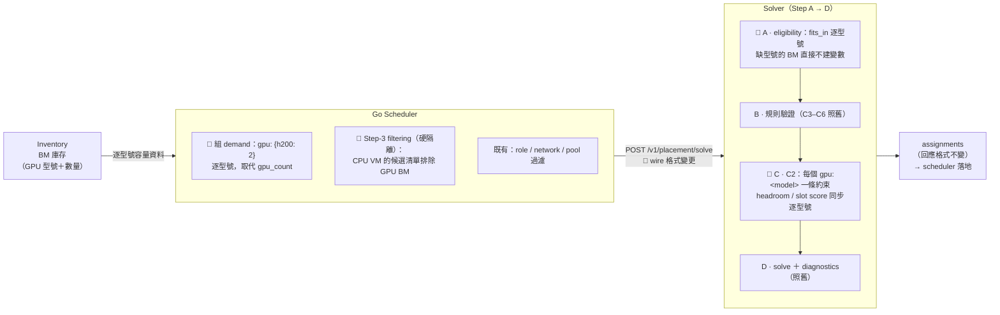

# GPU 逐型號資源記帳與專用池硬隔離 — 設計文件（10 分鐘簡報版）

- **PR**: [dy850078/solver#35](https://github.com/dy850078/solver/pull/35)
- **決策記錄**: `docs/decisions/ADR-015-per-gpu-model-resource-accounting.md`（完整替代方案與取捨）
- **Scheduler 整合**: `docs/go-scheduler-guide.md` 情境 D
- **一句話**: 讓 solver 看得懂「這台 BM 有 4 顆 H200 + 4 顆 A100」，讓 H200 的需求只由
  H200 滿足，並保證純 CPU VM 不會吃掉 GPU 機的資源。

**講稿導覽（合計 ~10 分鐘）**

| 分鐘 | 章節 |
|---|---|
| 1 | [1. 問題：舊的 gpu_count 為什麼不夠用](#1-問題舊的-gpu_count-為什麼不夠用) |
| 2 | [2. 核心設計：每個 GPU 型號是一個獨立資源維度](#2-核心設計每個-gpu-型號是一個獨立資源維度) |
| 2 | [3. Request 契約改了什麼（breaking change）](#3-request-契約改了什麼breaking-change) |
| 2 | [4. E2E 流程的變化](#4-e2e-流程的變化) |
| 1.5 | [5. Scheduler 端要做的事（含硬隔離）](#5-scheduler-端要做的事含硬隔離) |
| 1 | [6. Solver 端改了什麼（附 code diff）](#6-solver-端改了什麼附-code-diff) |
| 0.5 | [7. 驗證結果與部署注意](#7-驗證結果與部署注意) |

---

## 1. 問題：舊的 gpu_count 為什麼不夠用

原本 `Resources` 只有一個 `gpu_count` 整數——所有 GPU 在 solver 眼中是同質、可互換的。
實務上撞到三個牆：

1. **需求無法指名型號**：「這台 VM 要 2 顆 H200」寫不出來，只能寫「要 2 顆 GPU」。
2. **混插機資訊遺失**：一台 3×H200 + 2×A100 的 BM 只能寫成 `gpu_count: 5`，
   solver 可能把 H200 的需求放到只剩 A100 的機器上。
3. **Stranded GPU**：純 CPU VM 可以自由落在 GPU 機上，把 cpu/mem 吃光之後——
   GPU 還在、卻再也開不出 GPU VM。

> **講者提示**：一句話版本——「以前 solver 只會數 GPU 的顆數，現在它認得型號，
> 而且我們保證 GPU 機不會被 CPU workload 占走。」

## 2. 核心設計：每個 GPU 型號是一個獨立資源維度

資源維度從固定的 4 個（cpu / mem / storage / gpu）變成 **3 個 scalar + 每個出現過的
GPU 型號一個維度**（內部記號 `gpu:h200`、`gpu:a100`…）。容量約束（C2）對每個維度
各建一條獨立限制式，所以：

- H200 的需求**只能**由 H200 的容量滿足——型號之間永不互換；
- 混插機的兩種型號**分開記帳**，互不佔用額度；
- CPU VM 落在 GPU 機上時，GPU 顆數**完全不受影響**（它只消耗 cpu/mem）。

三個先行定案的前提，讓這個設計保持簡單：

| 定案 | 意義 |
|---|---|
| **Demand 一律指名型號** | 不支援「給我 2 顆任意 GPU」。因此不需要任何新的求解變數——CP-SAT 模型形狀不變，只是維度變多，效能與可解釋性都不受影響。 |
| **`gpu_count` 直接汰換** | 不留新舊雙軌。舊欄位出現在 payload 會被 **422 明確拒絕**（附遷移訊息），而不是靜默忽略——忽略等於把未遷移 scheduler 的 GPU 需求無聲丟掉。 |
| **型號名稱由 scheduler 正規化** | Solver 只驗格式（open string，`^[\w.-]+$`），型號目錄歸 inventory 管——新 GPU 上市不用改 solver、不用重新部署。 |

## 3. Request 契約改了什麼（breaking change）

> ⚠️ **Breaking**：wire 格式不向後相容，scheduler 與 solver 必須**同版部署**。
> 回應（assignments）格式不變。

### VM 需求（demand）

```diff
 "demand": {
   "cpu_cores": 8,
   "memory_mib": 65536,
   "storage_gb": 200,
-  "gpu_count": 2
+  "gpu": { "h200": 2 }
 }
```

指名型號；無 GPU 需求則整個 `gpu` 欄位省略。

### BM 容量（total_capacity / used_capacity）

```diff
 "total_capacity": {
   "cpu_cores": 96,
   "memory_mib": 786432,
   "storage_gb": 8000,
-  "gpu_count": 8
+  "gpu": { "h200": 4, "a100": 4 }
 }
```

混插機可完整表達，兩型號分開記帳。

### 硬隔離：candidate_baremetals（scheduler step-3 filtering）

```diff
 // 純 CPU VM 的候選清單
 "candidate_baremetals": [
-  "bm-cpu-1", "bm-cpu-2", "bm-h200-1", "bm-mixed"
+  "bm-cpu-1", "bm-cpu-2"
 ]
```

候選清單排除所有 GPU BM → 硬隔離。同時：帶 `gpu_count` 的舊 payload → HTTP 422，
錯誤訊息直接告訴呼叫端新格式怎麼寫。

## 4. E2E 流程的變化

整條鏈路的**形狀不變**——還是 Inventory → Scheduler 組 request → Solver 求解 →
回傳 assignments。變的是三個節點的**內容**（標 🔶 者）：



值得強調的一點：**回應格式與下游落地流程零改動**——這次的 blast radius 全部集中在
「組 request」這一段。

## 5. Scheduler 端要做的事（含硬隔離）

1. **改送新格式**：demand / capacity 的 `gpu_count` 全面換成 `gpu: {"型號": 數量}`；
   無 GPU 就省略欄位。型號名稱由 scheduler 統一正規化（例如一律小寫 `h200`）。
2. **硬隔離過濾規則**（step-3 filtering 加一條，與既有 role/pool 過濾同一位置）：

   ```
   if len(vm.demand.gpu) == 0:      # 無 GPU 需求的 VM
       candidates = 只留 total_capacity.gpu 為空的 BM   # ← 硬隔離本體
   else:                            # GPU VM
       candidates = 只留載有所需全部型號的 BM
   ```

   CPU VM 那一側是關鍵——**solver 不會替你排除**；GPU VM 那一側多列無妨
   （solver 的適配檢查會自動剔除型號不符的機器）。
3. **兩個邊界**：
   - *Pinned VM 豁免*——已住在 GPU 機上的舊 CPU VM 是既成事實，照常以 `pinned_to`
     送入，規則只約束新 VM。
   - *空清單語意*——VM 層空 `candidate_baremetals` 是 INPUT_ERROR；CPU 池被過濾到
     剩零台時，scheduler 應在送出前就報錯。

## 6. Solver 端改了什麼（附 code diff）

一個核心重構帶動全部：原本 24 處「固定 4 欄位迴圈」（`RESOURCE_FIELDS` + `getattr`）
改為**動態維度清單**。以下是 commit `83cf2a6` 的關鍵 diff。

### 6.1 資料模型：`Resources.gpu` 成為 per-model dict（`app/models.py`）

```diff
 class Resources(BaseModel):
     cpu_cores: int = 0
     memory_mib: int = 0
     storage_gb: int = 0
-    gpu_count: int = 0
+    gpu: dict[str, int] = Field(default_factory=dict)   # e.g. {"h200": 5}

     def fits_in(self, capacity: Resources) -> bool:
         return (
             self.cpu_cores <= capacity.cpu_cores
             and self.memory_mib <= capacity.memory_mib
             and self.storage_gb <= capacity.storage_gb
-            and self.gpu_count <= capacity.gpu_count
+            and all(c <= capacity.gpu.get(m, 0) for m, c in self.gpu.items())
         )
```

`__add__` / `__sub__` 做 key-union 的逐型號加減；**負值刻意保留**（是 pinned 正規化偵測
庫存不一致的訊號）、零值在建構時剔除（`{}` 是唯一 canonical 的「無 GPU」）。另有
before-validator：payload 帶 `gpu_count` → 422 + 遷移訊息。

### 6.2 維度抽象：全 codebase 的單一事實來源（`app/models.py`）

```python
SCALAR_RESOURCE_FIELDS = ("cpu_cores", "memory_mib", "storage_gb")

def res_get(r: Resources, dim: str) -> int:
    """讀一個資源維度；"gpu:<model>" 讀 r.gpu（缺 key = 0）。"""

def resource_dims(resources: Iterable[Resources]) -> list[str]:
    """scalar 欄位 + 出現過的每個型號一個 "gpu:<model>" 維度（sorted，確定性）。"""
```

兩份舊的 `RESOURCE_FIELDS` 常數**刪除、不留 alias**——任何漏改處在 import 時就炸，
是 breaking change 想要的失敗模式。

### 6.3 容量約束 C2：每型號一條限制式（`app/solver.py`）

```diff
-            # For each resource dimension, add a capacity constraint
-            for field in RESOURCE_FIELDS:
-                capacity = getattr(avail, field)
+            # For each resource dimension (scalars + one per GPU model),
+            # add a capacity constraint
+            for dim in self.dims:
+                capacity = res_get(avail, dim)

                 # Build the usage expression: sum(demand * var)
                 usage = sum(
-                    getattr(self.vm_map[vm_id].demand, field) * var
+                    res_get(self.vm_map[vm_id].demand, dim) * var
                     for vm_id, var in assigned_vars
                 )

                 # The constraint: total usage <= capacity
                 self.model.add(usage <= capacity)
```

`self.dims` 由 module-level 的 `request_dims(request)` 解析（BM 容量 ∪ VM demand ∪
`vm_specs` 的型號聯集），並與 diagnostics 的 shadow C2 **共用同一份清單**——
INFEASIBLE 的失敗層歸因才不會與主模型不一致。

### 6.4 Pinned 驗證：逐型號偵測庫存不一致（`app/solver.py`）

```diff
+            # Per-BM dimension list: these checks only concern this host's
+            # capacities and its pinned demand. Checking per GPU model
+            # matters — a deficit on one model must not be masked by a
+            # surplus on another.
+            bm_dims = resource_dims(
+                [bm.total_capacity, bm.used_capacity, pinned_demand]
+            )
             over = [
-                f
-                for f in RESOURCE_FIELDS
-                if getattr(bm.used_capacity, f) > getattr(bm.total_capacity, f)
+                d
+                for d in bm_dims
+                if res_get(bm.used_capacity, d) > res_get(bm.total_capacity, d)
             ]
             ...
             effective_used = bm.used_capacity - pinned_demand
             negative = [
-                f for f in RESOURCE_FIELDS if getattr(effective_used, f) < 0
+                d for d in bm_dims if res_get(effective_used, d) < 0
             ]
```

錯誤訊息直接點名維度（如 `gpu:h200`）；單一型號的缺口不會被其他型號的餘裕遮蔽。

### 6.5 Splitter 覆蓋約束：只有帶 GPU 的 spec 能覆蓋 GPU 需求（`app/splitter.py`）

```diff
-        # Resource coverage: Σ_s count[s] × spec[s].field ≥ total.field
-        for field in RESOURCE_FIELDS:
-            total_demand = getattr(req.total_resources, field)
+        # Resource coverage: Σ_s count[s] × spec[s].dim ≥ total.dim
+        # (per dimension: the scalars + one per GPU model; only gpu-bearing
+        # specs contribute on a "gpu:<model>" dim, so demand for a model no
+        # spec carries stays uncovered → infeasible, never silently coerced)
+        for dim in resource_dims([req.total_resources, *specs]):
+            total_demand = res_get(req.total_resources, dim)
             if total_demand <= 0:
                 continue
             allocated = sum(
-                self.count_vars[(req_idx, si)] * getattr(specs[si], field)
+                self.count_vars[(req_idx, si)] * res_get(specs[si], dim)
                 for si in range(len(specs))
                 if (req_idx, si) in self.count_vars
             )
             self.model.add(allocated >= total_demand)
```

CPU-only spec 在 `gpu:h200` 維度上係數為 0，無法覆蓋 GPU 需求；沒有任何 GPU spec 時
走既有 infeasible 路徑，絕不靜默降級。waste terms、headroom、slot score、sizing floors、
mockgen 同步逐型號（同一組 helper，不再列出）。

**硬隔離本身在 solver 端零改動**——候選清單本來就是 Step A 的硬性約束，這正是把
政策放 scheduler 的理由：政策與它需要的資料（inventory）在同一邊。

## 7. 驗證結果與部署注意

- **417 個測試全數通過**（新增 30+ 個 GPU 專屬測試：混插機記帳、型號不可互換、
  pinned 逐型號驗證、splitter 覆蓋、422 契約）。
- **端對端驗證**（`make cli INPUT=examples/gpu_models.json`、
  `examples/gpu_dedicated_pool.json`）：混插機兩型號分開記帳、H200 VM 只落在有 H200
  的機器並照 HA 政策分散 3 個 AG、硬隔離下 CPU VM 只落在 CPU 池。
- **硬隔離的代價已驗證且是刻意的**：CPU 池滿時即使 GPU 機還有大量 cpu/mem，結果是
  INFEASIBLE（診斷指向 capacity）。若營運上常撞牆，下一步是 solver 端的「軟偏好」
  目標項（能避就避、必要時可借用）——目前刻意不做。

> ⚠️ **部署**：Scheduler 與 solver 需**同版上線**（wire 格式不相容，新 solver 會 422
> 拒絕舊 payload——這是設計行為，防止 GPU 需求被靜默丟失）。config fingerprint 會
> 全面換值，reconcile 對舊 plan 報 config drift 屬預期。

已知非目標（記錄於 ADR-015）：capacity planning 的需求輸入（`DemandEntry`）尚未支援
GPU——GPU 採購規劃是下一個題目。
