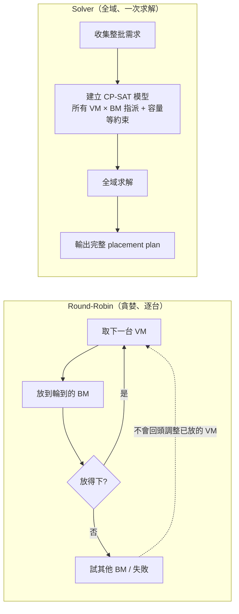

# 為什麼 Round-Robin 會「塞不下」—— 以 30/20 vCore 混合叢集為例

> **對象**：排程組工程師、需要理解為何導入 Solver 的相關人員
> **重點**：Pure Go scheduler 的 round-robin 不做最佳化，即使總容量足夠、
> 且存在可行擺法，仍可能回報「塞不下」。本文用線上實際遇到的規格重現此問題。

---

## TL;DR

- Round-robin 逐台分配、不回頭調整，**不考慮 VM 規格的組合方式**。
- 當叢集混用兩種 VM 規格（30 vCore 與 20 vCore、BM 64 vCore）時，
  round-robin 會把不同規格混在同一台 BM，每台卡在 50/64，
  剩下的 14 vCore **兩種 VM 都放不進去**（碎片化）。
- 結果：總剩餘容量明明足夠，卻沒有任何一台 BM 放得下下一台 VM → 排程失敗。
- Solver（CP-SAT）把所有 VM × BM 的指派當成一個整體問題求解，
  同規格自然聚在一起，同一批需求可以全部放下。

---

## 情境（線上實際規格）

| 項目 | 規格 |
|---|---|
| VM type A（worker） | 30 vCore |
| VM type B（worker） | 20 vCore |
| BM | 64 vCore × 3 台 |
| 需求 | 4 × A + 3 × B = **180 vCore** |
| 總容量 | 3 × 64 = **192 vCore** ✓ 足夠 |

### 關鍵：64 vCore 的可行組合只有三種

| 一台 BM 上的組合 | 用量 | 剩餘 | 備註 |
|---|---|---|---|
| A + A | 60 | 4 | ✓ 好組合 |
| B + B + B | 60 | 4 | ✓ 好組合 |
| A + B | 50 | **14** | ⚠ 剩 14，A(30)、B(20) 都塞不下 → 死掉的容量 |
| A + A + B（80）、A + B + B（70） | >64 | — | ✗ 超過容量，不可行 |

一台 BM 只要**同時放了 A 和 B，就永遠停在 50/64** —— 這就是問題的根源。

---

## Round-Robin 的實際過程（失敗）

VM 依序到達：`A, B, A, B, A, B, A`，scheduler 輪流分配到 BM-1 → BM-2 → BM-3：

```
（1 格 ≈ 2 vCore，全寬 = 64 vCore）

BM-1  |AAAAAAAAAAAAAAA|BBBBBBBBBB|·······|   50/64，剩 14
BM-2  |BBBBBBBBBB|AAAAAAAAAAAAAAA|·······|   50/64，剩 14
BM-3  |AAAAAAAAAAAAAAA|BBBBBBBBBB|·······|   50/64，剩 14

第 7 台 VM = A (30 vCore)：
  BM-1 剩 14 ✗   BM-2 剩 14 ✗   BM-3 剩 14 ✗   →  排程失敗
```

三台 BM 合計還有 **42 vCore 空著**（> 30，容量帳面上綽綽有餘），
但被切成三塊 14 vCore 的碎片，沒有一塊放得下 30 vCore 的 VM。

注意：即使 scheduler 有 snapshot、會跳過容量不足的 BM（見
[why-cp-sat.md](why-cp-sat.md)），結果一樣 —— 因為**三台 BM 全都不夠**，
沒有可跳去的地方。問題不在「不會跳過」，而在「前六台 VM 的擺法就已經錯了，
而 round-robin 不會回頭重排」。

---

## Solver 的擺法（成功）

CP-SAT 同時考慮全部 7 台 VM 與 3 台 BM 的所有指派組合，在容量限制下求解：

```
（1 格 ≈ 2 vCore，全寬 = 64 vCore）

BM-1  |AAAAAAAAAAAAAAA|AAAAAAAAAAAAAAA|··|   60/64  (A+A)
BM-2  |AAAAAAAAAAAAAAA|AAAAAAAAAAAAAAA|··|   60/64  (A+A)
BM-3  |BBBBBBBBBB|BBBBBBBBBB|BBBBBBBBBB|··|   60/64  (B+B+B)

7 台 VM 全數放下，全叢集僅剩 12 vCore 碎片（round-robin 是 42）
```

同規格聚在一起不是 solver 的特殊規則，而是「最大化可放數量」的自然解。

---

## 兩者的本質差異



| | Round-Robin | Solver (CP-SAT) |
|---|---|---|
| 決策範圍 | 一次看一台 VM | 一次看整批 VM × 所有 BM |
| 已放的 VM | 不會重排 | 全部同時決定 |
| 對到達順序 | **敏感**（同一批需求，換個順序結果不同） | 不敏感，結果一致 |
| 「塞不下」的意義 | 可能是假警報（碎片化） | 真的不可行才回 `INFEASIBLE`，並附診斷 |

這類問題本質是 **bin packing（裝箱問題）**，最佳解需要全域搜尋；
round-robin 的設計目標是「平均分散負載」，兩者目標根本不同。
規格混得越多、VM 相對 BM 越大（每台 BM 只放得下 2–3 台）、
叢集使用率越高，round-robin 與最佳解的差距就越大。
